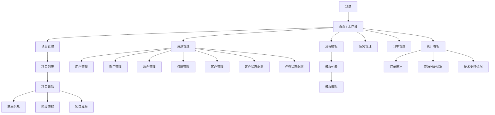
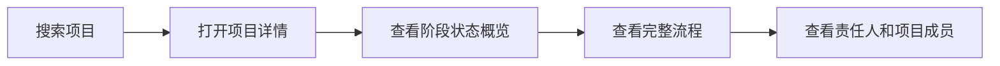

# Product Prototype — V1 可试点版

> Version: v0.1  
> Status: Draft for review

## 1. Prototype goal

V1 原型的目标不是覆盖所有未来能力，而是验证以下四件事：

1. 用户是否能快速找到某个产品项目
2. 用户是否能看懂项目当前走到哪一步
3. 用户是否能知道每个阶段由谁负责
4. 管理员和项目负责人是否能维护组织、项目和流程

## 2. Information architecture



## 3. Main navigation

### Primary navigation

- 首页 / 工作台
- 项目管理
- 任务管理
- 订单管理
- 统计看板
- 流程模板
- 资源管理

### Secondary navigation under 资源管理

- 用户管理
- 部门管理
- 角色管理
- 权限管理
- 客户管理
- 客户状态配置
- 任务状态配置

## 4. Core pages

### 4.1 首页 / 工作台

**Purpose**

让用户进入系统后快速看到与自己相关的信息。

**V1 suggested blocks**

- 我参与的项目
- 最近创建的项目
- 当前进行中的项目数量
- 快速搜索项目

**Future extension**

- 待审批
- 即将到期阶段
- 卡点求助
- 通知中心

### 4.2 项目列表

**Key fields**

- 对外名称
- 内部名称
- Model 名称
- 阶段状态概览
- 项目状态
- 项目负责人
- 最近更新时间

**Key actions**

- 新建项目
- 搜索
- 查看详情
- 编辑
- 归档
- 恢复
- 按归档状态筛选

**Product note**

- 项目不做物理删除，改用归档 / 恢复承接生命周期结束后的管理

### 4.3 新建项目

**Step 1：基本信息**

- 对外名称
- 内部名称
- Model 名称
- 项目描述
- 项目状态

**Step 2：选择流程模板**

- 选择一个已有模板

**Step 3：配置项目成员**

- 从已有用户中选择项目成员
- 分配项目内角色
- 项目负责人自动进入项目成员列表

**Step 4：配置阶段负责人**

- 为每个阶段绑定一个或多个真实负责人 / 负责部门

**Result**

- 创建真实项目记录
- 自动生成该项目的阶段路径
- 创建后进入项目详情

### 4.4 项目详情

**Recommended layout**

1. 顶部：项目名称、别名、状态、创建人
2. 中部主区域：阶段流程时间线
3. 右侧或下方：项目成员与项目内角色
4. Tabs / entries：
   - 基本信息
   - 阶段流程
   - 项目成员
   - 客户列表

**Stage card fields**

- 阶段名称
- 阶段状态
- 负责人 / 负责部门
- 预计时间（V1 可先占位，V2 实装）
- 状态维护入口（由阶段负责人维护）

### 4.5 流程模板列表

**Key fields**

- 模板名称
- 阶段数量
- 启用状态
- 最近更新时间

**Key actions**

- 新建模板
- 编辑模板
- 复制模板
- 启用 / 停用模板
- 删除草稿或已停用模板

### 4.6 流程模板编辑

**Key actions**

- 添加阶段
- 编辑阶段名称
- 调整顺序
- 删除阶段
- 保存模板

### 4.7 用户管理

**Key fields**

- 姓名
- 账号
- 所属部门（可多个）
- 全局角色（可多个）
- 用户直授权限
- 状态

**Key actions**

- 查询用户
- 新增用户
- 编辑用户
- 启用 / 停用用户

> 用户不做物理删除，以免历史项目、任务、审批记录失去引用对象。

### 4.8 部门管理

**Key fields**

- 部门名称
- 上级部门（如后续需要）
- 部门成员数（由用户归属自动统计）

**Key actions**

- 查询部门
- 新增部门
- 编辑部门
- 删除部门

> 部门仅维护组织关系，不直接承载权限。

### 4.9 角色管理

**Role types**

- 全局角色
- 项目内角色

**Key actions**

- 查询角色
- 新增角色
- 编辑角色
- 删除角色
- 配置权限
- 启用 / 停用

### 4.10 权限管理

**V1 scope**

- 菜单权限
- 按钮权限

**Data source**

- 左侧真实菜单自动生成菜单权限
- 页面中的真实业务按钮自动生成按钮权限

**Key actions**

- 查询权限
- 按类型筛选

> 权限管理页改为只读能力清单，不再手工维护权限字典；真正的授权入口仍放在“用户管理”的用户直授和“角色管理”的角色授权中。

**Reserved for later**

- 项目级权限
- 阶段级权限
- 信息级权限

### 4.11 客户管理

**Purpose**

维护客户基础资料，作为后续“项目下客户状态管理”的基础资源。

**Key fields**

- 客户名称
- 客户简称
- 国家 / 区域
- 负责销售
- 负责技术支持
- 客户状态

**Key actions**

- 查询客户
- 新增客户
- 编辑客户
- 删除客户

**Permission note**

- 客户录入与维护属于受控权限
- 该权限可以通过角色授权或用户直授进行配置

## 5. Key flows

### Flow A — 创建项目


### Flow B — 查看项目状态



## 6. Low-fidelity wireframe sketch

### 项目详情页

```text
┌──────────────────────────────────────────────────────────────┐
│ P8 dual / R2351 / K1352                         [编辑项目] │
│ 项目状态：进行中     阶段状态：软件适配进行中 / 测试生产未开始等 │
├──────────────────────────────────────────────────────────────┤
│ 阶段流程                                                     │
│ [提出想法]—[可行性]—[核算成本]—[硬件设计]—[软件适配]—[测试生产] │
│    完成       完成       完成       完成        进行中          │
├───────────────────────────────┬──────────────────────────────┤
│ 阶段详情                      │ 项目成员                     │
│ 阶段：软件适配                │ 共 12 人  [查看 / 维护]      │
│ 负责人：李四                  │ 点击后弹窗展示成员清单       │
│ 负责部门：软件部              │                              │
│                               │                              │
└───────────────────────────────┴──────────────────────────────┘
```

### 新建项目向导

```text
步骤 1/4 基本信息  →  步骤 2/4 流程模板  →  步骤 3/4 项目成员  →  步骤 4/4 阶段负责人
```

## 7. Prototype decisions already made

- V1 是可试点版，不是纯后台系统
- 用户可以属于多个部门
- 角色需要区分全局角色和项目内角色
- 部门只维护组织归属，不直接承担授权
- 权限通过角色授权或用户直授两种方式生效
- 项目负责人引用真实用户
- 项目负责人自动进入项目成员列表
- 项目成员引用真实用户，并在项目内分配角色
- 阶段负责人引用真实用户 / 部门，且一个阶段可绑定多个责任主体
- 项目必须展示完整阶段路径和每个阶段的独立状态
- 阶段负责人需要可配置
- 阶段之间允许并行推进，不再使用单一“当前阶段”逻辑
- 阶段状态由对应阶段负责人维护
- 项目详情页需要提供客户列表能力
- 项目基础信息和各阶段状态默认对具备系统访问权限的公司成员可见
- 系统需要支持中文 / English 双语切换
- 主菜单“组织与权限”调整为“资源管理”，并加入客户管理
- 客户录入 / 维护需要作为可授权权限存在
- 项目详情默认只展示项目成员人数，成员清单通过弹窗维护
- 阶段资料只保留“发布到项目资料区”，不再提供“共享到后续阶段”
- 任务状态与状态流转关系支持全局配置
- 客户可配置多个负责销售和多个负责技术支持
- 新增订单管理、统计看板和登录页

## 8. Open prototype questions

1. 工作台是否需要在 V1 就展示“我参与的项目”，还是可以先只保留项目搜索？
2. 流程模板在 V1 是否允许复制已有模板后再修改？
3. 项目详情页中，是否希望 V1 就出现一个“项目资料”Tab？

### 4.12 项目下客户管理

**Purpose**

在具体产品项目下维护客户关联关系和该客户针对当前产品的推进状态。

**Key fields**

- 客户名称
- 国家 / 区域
- 当前项目状态
- 负责销售
- 负责技术支持
- 最近更新时间

**Key actions**

- 关联已有客户
- 查看客户列表
- 维护客户在当前项目下的状态

**Product note**

- 客户基础资料由资源管理维护
- 客户在某个项目下的推进状态由项目客户关系维护

### 4.13 客户状态配置

**Purpose**

维护项目下客户状态的可选枚举值，不使用模板。

**Key actions**

- 查询状态
- 新增状态
- 编辑状态
- 启用 / 停用状态
- 删除状态

**Permission note**

- 仅有权限的人员可维护客户状态枚举

### 4.14 阶段详情

**Main blocks**

- 阶段基本信息
- 阶段资料库
- 阶段留言 / 记录流

**阶段资料库**

- 上传文件
- 下载文件
- 支持任意格式，包括图片、视频等

**阶段留言 / 记录流**

- 仅阶段负责成员可发布
- 支持文字
- 支持图片、视频和其他格式附件
- 按时间倒序展示

### 4.15 项目资料区

**Purpose**

承接由各阶段显式发布出来、供项目内复用的可信资料。

**Key fields**

- 资料名称
- 来源阶段
- 发布目标
- 发布时间

**Key actions**

- 查看项目资料
- 从阶段资料库发布资料到项目资料区

**Permission model**

- 阶段资料默认继承阶段详情访问权限
- 项目资料区只承接被主动发布出来的资料

### 4.16 任务管理

**Purpose**

集中管理来自项目和阶段的日常任务，借鉴 Jira 的基础字段设计，但不以替代 Jira 为目标。

**Key fields**

- 任务编号
- 标题
- 任务分类
- 所属项目
- 来源阶段
- 状态
- 优先级
- 创建者
- 执行者
- 参与者
- 预期完成时间

**Key actions**

- 从任务管理页新建任务
- 从阶段详情页弹窗新建任务
- 从任务编号进入任务详情
- 按关键字、项目、状态、优先级、执行者、分类筛选
- 配置任务状态
- 配置允许流转关系

**Task categories**

- 需求
- Bug
- 技术支持
- 其他

**Explicitly not in current scope**

- 看板
- Sprint
- Epic
- Story

### 4.17 菜单权限

**Rule**

左侧菜单并非默认对所有人可见，需要通过菜单权限配置后展示。

**Examples**

- 项目管理菜单
- 任务管理菜单
- 流程模板菜单
- 资源管理菜单

### 4.18 项目销售状态

**Purpose**

区分产品是否已经可以面向客户销售。

**Values**

- 可销售
- 不可销售

**不可销售原因**

- 仍处于设计或测试阶段
- 产品过老，不再继续推广
- 被遗弃的老项目

**List behavior**

- 项目列表支持按销售状态筛选

### 4.19 客户需求管理

**Customer requirement list**

- 从项目客户列表进入
- 每个客户维护自己的需求记录
- 记录格式参考敏捷开发需求：标题、用户故事、业务价值、验收标准、优先级、状态、提出人、提出日期
- 支持新增需求
- 支持作废需求
- 支持删除误录需求；正式产品中建议以“作废”为主，以保留业务痕迹
- 新建需求时默认勾选“同时创建关联任务”，但允许关闭
- 关联任务默认流转给需求创建者
- 由需求自动创建的任务，分类默认为“需求”
- 需求卡片展示关联任务 ID，可点击跳转任务详情
- 关联任务完成后，需求自动标记为“已实现”
- 关联任务被拒绝后，需求自动标记为“已拒绝”

**Requirement overview**

- 从项目详情进入
- 汇总多个客户的共性需求
- 用于产品提取、抽象和归纳
- 已作废需求不进入共性需求汇总

### 4.20 阶段卡点求助

- 从阶段详情发起
- 入口以“卡点求助”按钮呈现
- 点击后打开新增任务弹窗
- 用户填写卡点标题、问题描述、优先级、截止日期
- 用户同时选择任务分类
- 创建后自动生成任务
- 任务负责人默认为当前阶段负责人
- 项目负责人自动加入任务参与者
- 当前不单独设计延期流程，延期先通过任务截止日期与任务跟进体现

### 4.21 任务详情

- 从任务列表或需求卡片进入
- 展示任务编号、标题、状态、所属项目、来源阶段、来源、任务描述、创建者、执行者、参与者、优先级、预期完成时间
- 展示任务分类
- 若任务关联需求，则展示关联需求摘要并可跳回需求列表
- 可在任务详情页维护任务状态、任务描述、优先级、执行者、参与者和预期完成时间
- 支持上传任务附件
- 支持参与者和执行者留言讨论，留言可附带附件
- 若任务关联了需求：
  - 完成语义状态 → 需求 `已实现`
  - 拒绝语义状态 → 需求 `已拒绝`
  - 普通语义状态 → 需求 `实现中`

### 4.22 订单管理

- 支持订单新增、编辑、删除、查询
- 字段包含：下单日期、客户、项目、数量、具体规格、期望发货日期、计划发货日期、软件版本号、币种、单价、订单金额、创建人
- 订单金额由数量 × 单价自动计算
- 编辑订单时必须填写修改原因
- 系统自动记录修改人、修改时间、修改内容和修改原因
- 订单新增、编辑、删除纳入权限配置

### 4.23 统计看板

- 二级菜单：
  - 订单统计
  - 资源分配情况
  - 技术支持情况
- 订单统计：按年 / 季度 / 月份和项目筛选，展示销售额、订单数、产品数量
- 资源分配情况：以可拖拽地图展示客户分布、销售、技术支持和已售项目
- 技术支持情况：按客户展示客户 → 技术支持 → 当前任务统计的树状结构
- 技术支持任务统计可区分需求、Bug、其他任务和卡点任务，并支持悬浮查看列表、点击查看任务详情

### 4.24 登录页

- 提供登录逻辑
- 登录页采用“四个小人跟随鼠标，输入密码时捂眼睛”的互动效果
- 登录后点击右上角用户名可展开“退出登录”
