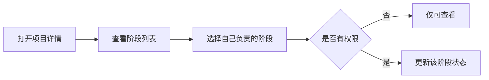
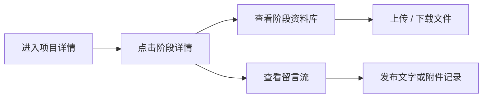
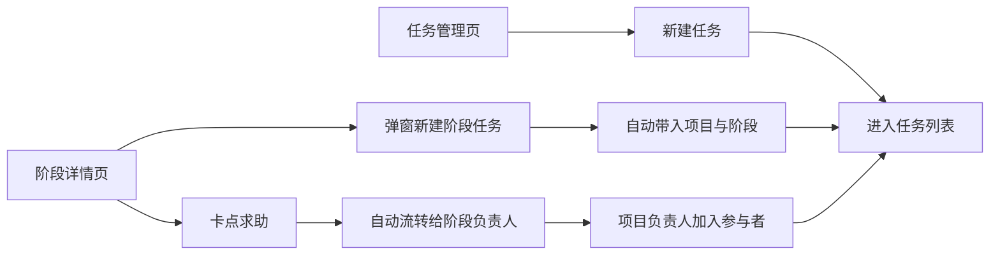
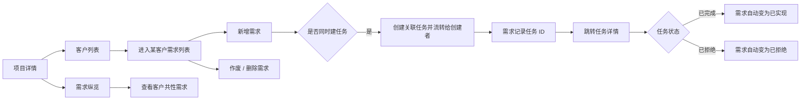

# KPM V1 Product Prototype Specification

> Version: v0.1  
> Status: Draft for review  
> Prototype type: Low-fidelity clickable Web prototype
> Note: The Phase 1 prototype is now being expanded toward the full product blueprint before Phase 2 begins.

## 1. Product decisions confirmed for V1

1. V1 是“可试点版”，不是纯后台基础版
2. 同一个用户可以属于多个部门
3. 用户可在不同项目中承担不同的项目内角色
4. 项目基础信息与各阶段状态，默认对具备系统访问权限的公司成员可见
5. 各阶段可以并行进行，不存在唯一“当前阶段”
6. 每个阶段状态由对应阶段负责人维护
7. 项目详情页需要支持项目下客户列表与客户状态维护
8. 系统从 V1 起支持中文与英文
9. 项目客户状态使用可配置枚举值，不使用模板
10. 每个阶段需要可进入独立详情页，并具备资料库和留言能力
11. 阶段详情是资料访问权限边界，阶段资料默认继承该权限
12. 需要跨阶段复用的资料通过“发布到项目资料区”显式流转
13. 复杂审批、单独延期流程、Jira 集成、钉钉通知暂不进入 V1
14. 阶段卡点求助复用任务模型，从阶段详情发起并自动流转给阶段负责人
15. 项目负责人引用真实用户，项目成员引用真实用户并在项目内分配角色
16. 每个阶段可绑定一个或多个真实负责人，不再直接选择负责部门
17. 项目负责人会自动进入项目成员列表
18. 项目详情页默认只显示成员人数，成员清单通过弹窗维护
19. 任务状态与允许流转关系支持全局配置
20. 客户可配置多个负责销售和多个负责技术支持
21. 新增订单管理、统计看板和登录页

## 2. V1 main navigation

| Navigation | Purpose |
| --- | --- |
| 工作台 | 查看自己参与的项目和项目概览 |
| 项目管理 | 查询、创建、维护项目 |
| 客户管理 | 维护客户档案、联系人、客户资料、跟进记录与客户下单入口 |
| 任务管理 | 管理来自页面或阶段详情创建的任务 |
| 订单管理 | 管理客户订单、发货计划与修改记录 |
| 统计看板 | 查看订单、资源分配和技术支持情况 |
| 流程模板 | 维护可复用的产品生命周期流程 |
| 资源管理 | 维护用户、部门、角色、权限和系统枚举 |

## 3. Main screens

### 3.1 工作台

#### Purpose

让用户一进入系统就能回答两个问题：

1. 我参与了哪些项目？
2. 这些项目现在分别走到哪里了？

#### Main blocks

- 我的项目
- 最近更新项目
- 项目搜索框
- 项目状态概览

#### Main fields

- 项目名称
- 内部名称
- Model 名称
- 进行中阶段
- 阶段负责人
- 最近更新时间

### 3.2 项目列表

#### Main fields

- 对外名称
- 内部名称
- Model 名称
- 阶段状态概览
- 项目状态
- 项目负责人
- 更新时间

#### Main actions

- 新建项目
- 搜索项目
- 查看详情
- 编辑项目（弹窗）
- 归档项目（二次确认）
- 恢复项目（二次确认）
- 删除项目（二次确认）
- 按归档状态筛选

### 3.3 新建项目向导

#### Step 1 — 基本信息

- 对外名称
- 内部名称
- Model 名称
- 项目描述
- 项目状态

#### Step 2 — 选择流程模板

- 模板名称
- 阶段数
- 预览流程

#### Step 3 — 配置项目成员

- 通过输入搜索从已有用户中添加成员
- 为成员分配项目内角色
- 一个成员可拥有一个或多个部门归属，但在当前项目中只需明确其项目职责
- 项目负责人自动出现在成员列表中，不允许在仍担任负责人时被误删

#### Step 4 — 配置阶段负责人

- 每个阶段可通过输入搜索选择一个或多个负责人
- 阶段负责人不再直接选择负责部门

#### Result

- 创建真实项目记录
- 生成项目阶段实例
- 创建后进入项目详情

### 3.4 项目详情页

#### Main areas

1. 项目基本信息
2. 阶段状态概览
3. 完整阶段路径
4. 阶段详情面板
5. 项目成员面板
6. 客户列表

#### Key actions

- 编辑项目信息
- 修改阶段状态
- 修改阶段负责人
- 进入客户列表

#### Visibility rule

- 项目基础信息与各阶段状态：默认对具备系统访问权限的公司成员可见
- 阶段资料默认继承阶段详情权限；跨阶段共享通过显式发布完成

### 3.5 流程模板列表

#### Main fields

- 模板名称
- 适用范围
- 阶段数
- 状态
- 最近更新时间

#### Main actions

- 新建模板
- 复制模板
- 编辑模板
- 启用 / 停用模板
- 删除草稿或已停用模板

### 3.6 流程模板编辑页

#### Main actions

- 添加阶段
- 编辑阶段
- 调整阶段顺序
- 删除阶段
- 保存模板
- 仅“启用”模板可在创建项目时被选择

### 3.7 资源管理

#### 用户管理

- 用户姓名
- 账号
- 所属部门（多选）
- 全局角色（多选）
- 用户直授权限（列表显示数量摘要，编辑时通过搜索真实权限维护）
- 状态
- 支持查询、新增、编辑、启用 / 停用

#### 部门管理

- 部门名称
- 平铺部门，不维护上下级关系
- 成员数（根据用户所属部门自动统计）
- 支持查询、新增、编辑、删除

#### 角色管理

- 角色名称
- 角色类型：全局角色 / 项目内角色
- 已授权权限（列表显示数量摘要，编辑时通过搜索真实权限维护）
- 支持查询、新增、编辑、删除

#### 权限管理

- 菜单权限
- 按钮权限
- 系统根据真实菜单与真实按钮自动生成权限清单
- 角色授权汇总
- 用户直授权限汇总
- 支持查询和按类型筛选
- 不支持手工新增、编辑、删除权限
- 授权入口放在用户管理和角色管理，不在权限管理处操作
- 后续预留数据级权限

#### 客户项目状态配置

- 维护客户与项目关系状态枚举值
- 不需要模板
- 仅有权限的用户可查询、新增、编辑、启用 / 停用、删除未使用状态

#### 订单类型配置

- 维护订单类型枚举值
- 默认示例：样品订单 / 预订单 / 正式订单
- 仅有权限的用户可查询、新增、编辑、启用 / 停用、删除类型

#### 任务状态配置

- 维护全局任务状态
- 维护状态语义：普通 / 完成 / 拒绝
- 维护允许流转关系
- 任务详情页按流转关系展示可选下一状态

### 3.8 客户管理

- 客户名称
- 客户简称
- 国家 / 区域
- 客户等级
- 负责销售
- 负责技术支持
- 客户状态
- 联系人数、资料数、订单数摘要
- 支持查询、新增、编辑、删除
- 支持进入客户详情
- 客户详情支持联系人维护
- 客户详情支持客户资料上传、查看和下载
- 客户详情支持以留言和附件记录客户跟进
- 客户详情支持直接创建当前客户订单
- 客户详情支持查看关联项目列表，展示项目客户状态、项目销售状态、订单数量和最近订单
- 客户录入 / 维护 / 详情操作权限可通过角色授权或用户直授控制

### 3.9 项目下客户管理

- 查看当前项目关联客户
- 关联已有客户
- 维护客户在当前项目下的状态
- 预置状态包括：商机发掘、样机测试、研发投入、订单冲刺、首单护航、量产维护、EOL 声明、EOL、Support Ended
- 同一客户在不同项目下可以有不同状态

### 3.10 阶段详情

- 从项目详情点击具体阶段进入
- 查看阶段基本信息
- 查看 / 上传 / 下载阶段资料
- 发布阶段留言或记录
- 留言支持文字、图片、视频和其他附件
- 留言按时间排序展示

### 3.10 项目资料区

- 展示由阶段发布出来的共享资料
- 展示来源阶段、发布目标、发布时间
- 让项目内成员复用关键资料

### 3.11 任务管理

- 从任务页直接新建任务
- 从阶段详情页通过弹窗发起任务
- 新建任务时选择任务分类
- 首期分类包括：需求、Bug、技术支持、其他
- 支持分类、状态、优先级、创建者、执行者、参与者、项目、来源阶段、预期完成时间
- 支持条件筛选与搜索
- 支持从任务编号进入任务详情
- 任务详情展示关联对象与状态流转
- 任务状态支持配置，状态流转支持定制
- 当前只用于项目成员日常任务记录与管理
- 暂不做看板、Sprint、Epic、Story

### 3.12 菜单权限

- 左侧菜单按权限显示
- 菜单权限可通过角色授权或用户直授配置

### 3.13 项目销售状态

- 项目具有销售状态：可销售 / 不可销售
- 不可销售时记录原因
- 项目列表支持按销售状态筛选

### 3.14 客户需求管理

- 从项目客户列表进入某个客户的需求列表
- 需求记录采用敏捷风格结构
- 支持新增需求
- 支持作废需求
- 支持删除误录需求
- 新建需求时默认支持同时创建关联任务
- 关联任务默认流转给需求创建者
- 由需求自动生成的关联任务，分类默认为“需求”
- 需求记录关联任务 ID，并支持点击跳转到任务详情
- 关联任务完成后，需求自动标记为“已实现”
- 关联任务被拒绝后，需求自动标记为“已拒绝”
- 项目详情提供需求纵览，用于提炼共性需求

### 3.15 阶段卡点求助

- 阶段详情提供“卡点求助”入口
- 点击后打开新增任务弹窗
- 创建后自动流转给阶段负责人
- 项目负责人自动加入参与者
- 延期暂不单独建模，先通过任务截止日期和任务跟进体现

### 3.16 任务详情

- 从任务列表或需求卡片进入
- 展示任务编号、标题、状态、描述、创建者、执行者、参与者、预期完成时间与关联对象
- 展示任务分类
- 若任务关联需求，可从任务详情跳回需求列表
- 支持在任务详情页维护任务状态、描述、优先级、执行者、参与者和预期完成时间
- 支持上传任务附件
- 支持任务留言，留言可带附件

### 3.17 订单管理

- 支持订单新增、编辑、删除、查询
- 字段包括：订单类型、下单日期、下单客户、项目信息、数量、具体规格、期望发货日期、计划发货日期、软件版本号、币种、单价、订单金额、创建人
- 订单类型来自资源管理中的订单类型配置
- 新建订单时，如果客户与项目尚未关联，则自动建立客户-项目关联
- 自动关联状态规则：样品订单 → 样机测试；预订单 → 商机发掘；正式订单 → 订单冲刺
- 订单金额由数量 × 单价计算
- 订单修改时记录修改人、时间、内容和原因
- 订单 CRUD 纳入权限配置

### 3.18 统计看板

- 二级菜单：订单统计 / 资源分配情况 / 技术支持情况 / 客户活跃度
- 订单统计支持按年、季度、月份、项目、客户、地区筛选；项目筛选使用可搜索多选下拉；销售额支持统一换算为 USD / CNY；并以柱状图 + 折线图组合展示项目对比和趋势
- 资源分配情况以可拖拽地图展示客户、销售、技术支持和已售项目，并支持全屏展开
- 技术支持情况支持输入搜索客户，并以树状图展示客户、技术支持、当前任务统计和卡点任务
- 客户活跃度展示顶部 KPI、客户 × 项目活跃矩阵和风险客户列表
- 客户活跃度状态包括活跃、观察、停滞、遗弃、异常
- 客户活跃度识别 CRM 有商机但 KPM 无跟进、KPM 有投入但 CRM 无商机的异常关系
- 客户活跃度矩阵格子支持点击弹窗查看详情与建议动作

### 3.19 登录页

- 支持登录逻辑
- 登录页使用四个小人跟随鼠标、输入密码时捂眼睛的互动设计
- 点击右上角用户名可退出登录

## 4. Primary business flows

### 4.1 创建项目

### 4.2 维护阶段状态

### 4.3 查询项目责任人

### 4.4 维护项目客户状态

### 4.5 进入阶段详情并协作

### 4.6 发布阶段资料

### 4.7 创建任务

### 4.8 管理客户需求

## 5. V1 prototype acceptance checklist

- 能从工作台进入项目详情
- 能从项目列表找到某个产品型号
- 能通过四步创建真实项目
- 新建项目状态默认为未开始，不需要手工选择项目状态
- 销售状态为可销售时，不展示不可销售原因
- 项目状态随阶段状态自动推导
- 能通过弹窗编辑项目基础信息
- 能归档、恢复和删除项目，且操作前有二次确认
- 能按归档状态筛选项目
- 能在项目详情中看到完整阶段路径
- 能看到各阶段负责人
- 能通过原型演示单个阶段状态维护
- 能查看项目下客户列表
- 能关联已有客户
- 能维护客户在当前项目下的状态
- 能配置客户项目状态枚举值
- 能从项目详情进入阶段详情
- 能查看阶段资料库和阶段留言流
- 能将阶段资料发布到项目资料区，且发布前有二次确认
- 能查看项目资料区
- 能按菜单权限展示左侧导航
- 能在客户管理中查询、新增、编辑、删除客户
- 能在客户管理中维护客户等级
- 能进入客户详情维护联系人、资料、跟进记录
- 能从客户详情直接创建该客户订单
- 能在客户详情查看关联项目列表和每个项目下的客户项目状态
- 新建订单时，如果客户与项目未关联，能自动建立关联并按订单类型初始化状态
- 能在资源管理中查询、新增、编辑用户
- 能在资源管理中停用 / 启用用户
- 能在资源管理中对部门、角色、权限执行查询 / 新增 / 编辑 / 删除
- 能在资源管理中对客户项目状态执行查询 / 新增 / 编辑 / 启停 / 删除
- 能在资源管理中配置客户等级和订单类型
- 能在资源管理中配置任务状态与流转关系
- 能在任务管理页创建任务
- 能从阶段详情创建任务
- 能按条件筛选任务
- 能在新建任务时选择分类
- 能从任务编号进入任务详情
- 能在任务详情中编辑任务信息、上传附件并留言
- 能按销售状态筛选项目
- 能查看客户需求列表
- 能新增需求
- 能作废或删除需求
- 能在新建需求时同步创建关联任务
- 能从需求跳转到任务详情
- 能在任务完成 / 被拒绝后看到需求状态自动回写
- 能查看项目需求纵览
- 能从阶段详情发起卡点求助任务
- 能看到卡点求助任务自动指派阶段负责人并加入项目负责人参与
- 能管理订单并查看订单修改记录
- 能查看订单统计、资源分配情况、技术支持情况和客户活跃度
- 能在客户活跃度中查看客户 × 项目矩阵、风险客户列表和 CRM / KPM 数据不一致提示
- 能登录并从右上角退出登录
- 能看到中英文切换入口
- 能在流程模板中完成新增、查询、编辑、复制、启用 / 停用，以及对草稿或停用模板的删除
- 能在流程模板中新增、改名、排序、删除阶段
- 能看到客户、订单、任务、需求、资源配置等轻量新增 / 编辑操作以弹窗承载，列表页不被表单打断
- 能在订单新增和项目客户关联时通过输入搜索选择客户 / 项目

## 6. Explicitly not represented in the V1 prototype

- 审批流
- 单独延期流程
- Jira 任务创建
- 钉钉通知
