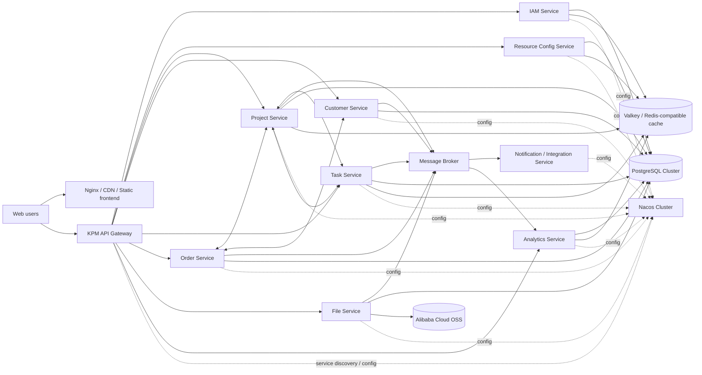

# KPM Phase 2 Technical Solution Proposal — Distributed Microservice Revision

> Last updated: 2026-05-26
> Status: Proposed, waiting for Henry confirmation
> Supersedes: 2026-05-22 modular-monolith-first proposal

## 1. Executive recommendation

Because the expected capacity has changed from about **100 concurrent users** to at least **1000 concurrent users**, and because Kozen prefers **microservice development + distributed deployment + Nacos-like centralized configuration**, KPM should move from the previous modular-monolith proposal to a **controlled Java microservice architecture**.

The key word is **controlled**: KPM should use microservices, but it should not split every screen or table into a separate service. The product has many strongly connected business flows, so the right design is to split by stable business ownership and operational pressure, while keeping cross-service workflows explicit and observable.

Recommended architecture baseline:

- **Backend:** Eclipse Temurin OpenJDK 21 LTS + Spring Boot 4.0.x + Spring Cloud 2025.1.x + Spring Cloud Alibaba 2025.1.x; Java 8 is not recommended for the new core system
- **Service registry / config center:** Nacos 3.1.x cluster
- **Gateway:** Spring Cloud Gateway
- **Traffic protection:** Sentinel for rate limiting, circuit breaking, and degradation rules
- **Async events:** RocketMQ or another enterprise message broker; RocketMQ fits naturally with Spring Cloud Alibaba
- **Database:** PostgreSQL 18.x, schema-per-service at first, physical DB separation only when needed
- **Cache / distributed coordination:** Valkey-first Redis-compatible cache layer
- **Files:** Alibaba Cloud OSS as the first production file-storage implementation, behind an internal storage abstraction
- **Frontend:** React 19 + TypeScript + Vite + Ant Design
- **Deployment:** Docker Compose for local/dev, Kubernetes-ready distributed deployment for staging/production
- **Observability:** OpenTelemetry-style tracing + metrics + centralized logs from day one

My recommendation is to adopt **microservices from the beginning**, but with a restrained first split and a monorepo. This gives Kozen distributed deployment capability without drowning Phase 3 in infrastructure ceremony.

### 1.1 Cost and license policy

Kozen should treat cost and license risk as first-class architecture constraints. The default rule is:

1. Prefer **free, open-source, self-hostable** components.
2. Prefer permissive licenses such as Apache 2.0, BSD, MIT, PostgreSQL License, or similar.
3. Avoid commercial-only products for core infrastructure unless there is a clear operational reason.
4. Avoid components whose current license creates uncertainty for internal production use or future distribution.
5. Managed cloud services may still be used later, but they should be an operational choice, not a vendor lock-in requirement.
6. Commercial support subscriptions are optional and should be separated from the technical dependency itself.

Cost-conscious defaults:

| Area | Free-first recommendation | Notes |
| --- | --- | --- |
| JDK | Eclipse Temurin OpenJDK 21 LTS | Final selected JDK for KPM. Avoid Oracle JDK 8 as the new-system default. |
| Database | PostgreSQL | Strong open-source license and no enterprise edition dependency. |
| Cache | Valkey | Redis-compatible direction with a permissive BSD license; safer as a default than assuming all Redis-branded distributions have the same terms. |
| Registry/config | Nacos | Open-source and fits the Spring Cloud Alibaba ecosystem. |
| MQ | Apache RocketMQ | Open-source Apache project; good fit if Kozen accepts the added operational complexity. |
| Identity | KPM built-in account/password login + JWT | Kozen has no SSO, so IAM service owns login, password policy, token issuance, and later SSO compatibility. |
| Object storage | Alibaba Cloud OSS | Use OSS for actual file storage; keep an abstraction layer so future migration remains possible. |
| Observability | Prometheus + Grafana + Loki/ELK + OpenTelemetry | Free/self-hostable, with optional paid managed choices later. |

The practical goal is not zero cost. Servers, storage, backup, monitoring, and operations still cost money. The goal is to avoid **license fees and vendor lock-in as mandatory dependencies**.

### 1.2 Java version decision

Java 21 is selected as the KPM core runtime. This is not because it is fashionable; the real constraint is the Spring ecosystem version. Spring Boot 4.x requires a modern Java baseline, so Java 8 would force KPM onto old Spring Boot / Spring Cloud versions.

Final decision:

| Option | Can it work? | Recommendation | Reason |
| --- | --- | --- | --- |
| Eclipse Temurin OpenJDK 21 LTS | Yes | **Selected** | Modern LTS, good performance, long runway, fits Spring Boot 4/Spring Cloud 2025. |
| Eclipse Temurin OpenJDK 17 LTS | Yes | Safe fallback | Lower adoption risk than 21 while still compatible with Spring Boot 4. |
| Oracle JDK Java 8 | Technically possible only with old Spring stack | Not recommended | Would require downgrading Spring Boot/Spring Cloud, increases security/maintenance risk, and may introduce Oracle licensing/support concerns. |
| OpenJDK 8 distribution | Possible for legacy adapter only | Avoid for KPM core | Acceptable only if an old external system requires a small compatibility adapter. |

If a legacy integration requires Java 8, isolate it into a small adapter service instead of lowering the whole KPM platform to Java 8.

## 2. What changed from the earlier proposal

| Area | Earlier assumption | New assumption | Architecture impact |
| --- | --- | --- | --- |
| Concurrency | About 100 concurrent users | At least 1000 concurrent users | Need explicit capacity targets, load testing, horizontal scaling, rate limiting, caching, and HA topology |
| Architecture preference | Modular monolith first | Microservices preferred | Start with bounded services and distributed deployment patterns |
| Runtime configuration | Normal app config | Nacos-like real-time config center | Add Nacos cluster, config namespaces, change governance, and refresh strategy |
| Operational model | Docker Compose pilot, Kubernetes-ready later | Distributed deployment expected | Design for Kubernetes, service discovery, gateway routing, health checks, observability |
| Business risk | Fast first build | Maintainability under scale and team growth | Stronger service boundaries, API contracts, event model, idempotency, and auditability |

## 3. Capacity target and acceptance SLO

“1000 concurrent users” needs a precise engineering definition. Simultaneous logged-in users are not the same as 1000 requests per second. For KPM, a reasonable Phase 3 target should be:

| Metric | Recommended target for acceptance |
| --- | --- |
| Concurrent logged-in users | 1000 |
| Normal API traffic | 300–600 requests/second during active use |
| Short burst traffic | 1000–1500 requests/second for read-heavy pages |
| List/detail API latency | p95 under 500 ms for normal pages |
| Write API latency | p95 under 1000 ms for normal create/update actions |
| Dashboard latency | p95 under 2000 ms, using cache or summary tables where needed |
| Error rate under load | below 1%, excluding intentional rate-limit responses |
| File upload/download | Direct object-storage upload/download where possible; app services only authorize and issue signed URLs |

These numbers should be validated with k6 or JMeter before acceptance. If real usage proves heavier, we can tune the targets before production launch.

## 4. Proposed high-level architecture



## 5. Recommended service boundaries

### 5.1 First-wave services

| Service | Owns | Notes |
| --- | --- | --- |
| `kpm-gateway` | API routing, authentication entry, rate limiting, request tracing | No business data. Routes web/API traffic to backend services. |
| `kpm-iam-service` | users, departments, roles, permissions, login identity mapping, effective permission calculation | Departments are flat in V1; users can belong to multiple departments; permissions are role grants + direct user grants. |
| `kpm-resource-service` | configurable enums and business configuration catalogs | Customer level, customer-project status, order type, task category, task status, task transitions, salesability reasons. |
| `kpm-project-service` | projects, workflow templates, project stages, stage owners, stage files/messages metadata, project materials, project-customer relationship, requirements | This is the core product-lifecycle service. It owns stage status and derived project status. |
| `kpm-customer-service` | customer master data, contacts, customer materials, follow-up records, sales/support owner relationships | Customer-project relation status belongs to project service because it is project-contextual. |
| `kpm-task-service` | tasks, task status transitions, task comments, participants, assignees, task attachments metadata | Owns task lifecycle and emits task outcome events. |
| `kpm-order-service` | orders, order history, currency and amount fields, order audit trail | Creates order records and triggers customer-project linkage rules. |
| `kpm-file-service` | upload/download authorization, file metadata facade, signed URLs | Binary content lives in object storage. Business ownership still checked with owner services. |
| `kpm-analytics-service` | order statistics, resource allocation, support statistics, customer activity analytics | Uses read models, summaries, or cached aggregates; should not put heavy dashboard queries on core services. |
| `kpm-integration-service` | DingTalk, Jira, CRM sync, notification dispatch | Consumes outbox/MQ events and isolates external-system instability. |

### 5.2 Later optional services

| Service | When to add |
| --- | --- |
| `kpm-workflow-service` | When approval workflows are resumed and become complex enough for a workflow engine |
| `kpm-search-service` | When global search becomes important or PostgreSQL search is not enough |
| `kpm-audit-service` | When audit volume or compliance requirements justify separating audit storage |

## 6. Important boundary decision: Nacos config vs KPM business configuration

Nacos should be used for **technical runtime configuration**, not as the source of truth for KPM business data.

### Good uses for Nacos

- service discovery
- service routing metadata
- feature flags
- timeout and retry parameters
- Sentinel rule parameters or rule source configuration
- integration switches, e.g. enable/disable DingTalk/Jira/CRM sync
- dashboard cache TTLs
- scheduled-job switches
- environment-specific endpoint configuration
- non-secret operational parameters

### Do not use Nacos for these business configurations

- project workflow templates
- stage statuses
- task statuses and task status transitions
- customer levels
- customer-project statuses
- order types
- menu/button permission catalog
- user/role/permission assignments

Those belong in KPM service databases because they need:

1. permission-controlled maintenance,
2. audit history,
3. Chinese/English labels,
4. validation against existing business records,
5. rollback/version semantics,
6. normal query/reporting behavior.

### License-sensitive component notes

- **JDK:** use Eclipse Temurin OpenJDK 21 LTS for the new core system. Java 8 is technically possible only with an older Spring stack, but it is not recommended for KPM's microservice baseline. Avoid Oracle JDK 8 as the default because of support/licensing and ecosystem age concerns.
- **Cache:** design against the Redis protocol where useful, but default deployment should be Valkey unless Kozen already has an approved Redis-compatible platform.
- **Object storage:** use Alibaba Cloud OSS for production file storage. Keep KPM code behind a storage abstraction so the implementation can be changed later if Kozen moves clouds or storage vendors.
- **Commercial editions:** do not depend on paid enterprise features of any component for V1 acceptance.

The recommended pattern is:

```text
KPM business config stored in PostgreSQL
  -> cached in Valkey / Redis-compatible cache
  -> changed through authorized KPM UI/API
  -> emits config-changed event through MQ
  -> affected services refresh local cache
```

This gives Kozen real-time business configurability without abusing the infrastructure config center.

## 7. Data ownership and database strategy

For a practical first microservice version, use **schema-per-service inside one PostgreSQL cluster**:

```text
kpm_iam.*
kpm_resource.*
kpm_project.*
kpm_customer.*
kpm_task.*
kpm_order.*
kpm_file.*
kpm_analytics.*
kpm_integration.*
```

Why this approach:

- It preserves service ownership boundaries.
- It avoids cross-service table joins in application code.
- It is much easier to operate than one physical database per service during the pilot.
- If one service later becomes large, that schema can be moved to a dedicated database.

Rules:

1. A service may write only its own schema.
2. A service should not directly query another service's schema in application code.
3. Cross-service data should be accessed through APIs, events, or analytics read models.
4. All schema changes are managed by Flyway per service.
5. IDs should be UUID/UUIDv7-style internal IDs, with separate human-readable business numbers such as `KPM-101`, `TASK-202605-001`, `ORD-202605-001`.

## 8. Cross-service consistency strategy

Do **not** start with heavy distributed transactions as the default. They add operational complexity and make failures harder to reason about.

Recommended default:

- local database transaction inside the owning service
- transactional outbox table
- MQ event publish after commit
- idempotent event consumers
- retry with dead-letter handling
- reconciliation jobs for critical workflows

### Example: order creation auto-links customer and project

Required product behavior:

- When creating an order, if the customer and project are not yet linked, KPM should auto-create the relationship.
- Initial project-customer status depends on order type:
  - sample order -> 样机测试
  - pre-order -> 商机发掘
  - formal order -> 订单冲刺

Recommended implementation:

```text
1. Frontend submits order to order service.
2. Order service validates customer and project existence through APIs or cached references.
3. Order service calls project service idempotent endpoint:
   PUT /internal/project-customers/ensure-link
4. Project service creates or keeps the relationship and returns current relation id/status.
5. Order service saves order and order history in its own transaction.
6. Order service writes outbox event: OrderCreated.
7. Analytics and notification services consume the event.
```

If step 3 temporarily fails, the order service should return a clear error rather than creating a half-valid order. For later high-throughput scenarios, this can evolve into a Saga/event-driven repair flow, but the first implementation should preserve user-visible correctness.

### Example: task outcome syncs requirement status

```text
1. Task service changes task status in local transaction.
2. Task service emits TaskStatusChanged event with semantic: ordinary/completed/rejected.
3. Project service consumes the event.
4. If the task is linked to a requirement, project service updates requirement status.
5. Operation is idempotent by event id and task id.
```

This keeps task lifecycle ownership in task service while letting project service own requirement data.

## 9. API and frontend integration

API style should remain REST JSON first, with OpenAPI contracts.

Recommended public API path pattern:

```text
/api/iam/**
/api/resources/**
/api/projects/**
/api/customers/**
/api/tasks/**
/api/orders/**
/api/files/**
/api/analytics/**
```

Gateway responsibilities:

- verify JWT/token and forward user/security context
- attach trace id
- route to backend services
- enforce coarse rate limits
- expose unified API base URL
- hide internal service topology from frontend

Service responsibilities:

- enforce fine-grained permissions again at service level
- validate business ownership and resource-level authorization
- return stable error codes
- publish OpenAPI definition

Frontend should continue with:

- React 19 + TypeScript
- Vite
- Ant Design
- react-i18next for Chinese/English
- TanStack Query for server state
- route-level permission guards
- button-level permission guards

Frontend guards are for user experience only. Backend services must remain authoritative.

## 10. Authentication and authorization

Recommended authentication:

Kozen currently has no SSO, so KPM should implement a built-in IAM login system in `kpm-iam-service`.

Scope for V1:

- account/password login
- password hashing with BCrypt or Argon2; never store plaintext passwords
- JWT access token + refresh token
- token revocation / logout support
- password reset by administrator in V1; email-based reset can be added later
- login failure limit and basic account lock policy
- login/audit log
- optional CAPTCHA after repeated failures
- keep the authentication boundary compatible with future SSO/OIDC integration

Important: “self-developed login” means KPM owns the account and login flow, but should still rely on mature Spring Security primitives. Do not invent custom cryptography or homegrown token algorithms.

Authorization model:

```text
User
  + global roles
  + project roles
  + direct user grants
  + project/customer/task resource context
  -> effective permissions
```

Permission types:

- menu permissions: whether the left navigation entry is visible
- button/action permissions: whether specific operations are allowed
- API authorization: backend-side enforcement for the same protected capability

Effective permission results should be cached in Valkey or another Redis-compatible cache with short TTL and invalidated by role/user/permission change events.

## 11. Runtime configuration and release governance

### Nacos namespace proposal

```text
dev
sit
uat
prod
```

### Nacos group proposal

```text
KPM_GATEWAY
KPM_IAM
KPM_RESOURCE
KPM_PROJECT
KPM_CUSTOMER
KPM_TASK
KPM_ORDER
KPM_FILE
KPM_ANALYTICS
KPM_INTEGRATION
COMMON
```

### Config governance rules

1. Production config changes require review.
2. Every config item needs owner, purpose, default value, and rollback guidance.
3. Secrets must not be stored in Nacos plaintext; use Kubernetes Secrets, Vault, or cloud secret manager.
4. Use dynamic refresh only for safe runtime values.
5. Changes that alter data behavior should go through KPM admin UI, not Nacos.
6. Keep config versions and rollback notes.

Good dynamic config examples:

- dashboard cache TTL
- max upload size
- integration enable/disable switches
- external API timeout/retry values
- rate-limit thresholds
- scheduled job switch
- feature rollout flags

Risky dynamic config examples:

- database schema behavior
- permission semantics
- task status semantics
- workflow template rules
- order amount calculation rules

Those should go through versioned application releases or controlled KPM business configuration.

## 12. High availability topology

Minimum non-production distributed topology:

| Component | Minimum topology |
| --- | --- |
| API Gateway | 2 replicas |
| Core services | 2 replicas each |
| Nacos | 3-node cluster |
| PostgreSQL | primary + standby, or managed HA PostgreSQL |
| Cache | Valkey cluster/Sentinel-compatible HA, or Kozen-approved Redis-compatible managed service |
| MQ | at least 3-node/broker HA for production-like testing |
| Object storage | Alibaba Cloud OSS; use lifecycle/backup/retention policy according to Kozen requirements |
| Frontend static hosting | Nginx/CDN with at least 2 replicas if self-hosted |

Production target:

- Kubernetes deployment with HPA for stateless services
- readiness/liveness/startup probes
- rolling updates and rollback
- resource requests/limits for every service
- centralized logs, metrics, traces, and alerts
- database backups and point-in-time recovery
- object-storage lifecycle and backup policy

## 13. Performance design rules

1. All list APIs must be paginated.
2. Search inputs must use server-side search, not full-list enumeration.
3. Dashboard APIs should use summary tables, materialized views, or cached aggregates when queries become heavy.
4. File upload/download should avoid passing large binary streams through business services when possible.
5. Permission and enum lookups should be cached but never treated as source of truth.
6. External integrations must run asynchronously where possible.
7. Use circuit breakers and timeouts between services.
8. Every write API should be idempotency-aware when retries are possible.
9. Add database indexes based on actual query patterns, especially:
   - project external/internal/model name
   - project status/salesability
   - customer name/region/level/owner
   - task status/category/assignee/participant/project/customer
   - order date/customer/project/region/order type
   - project-customer relation
   - audit/history tables by business id and time

## 14. Observability and operations

Every request should have a trace id from gateway to services to MQ consumers.

Monitoring is not a product feature for end users; it is an operations and debugging capability. In KPM it is used to answer questions like:

- Is the system alive and are all service replicas healthy?
- Which API is slow, and did the slowness come from gateway, service code, database, cache, OSS, or MQ?
- Are users seeing login/order/task/file-upload failures?
- Is the 1000-concurrent-user target still safe under real traffic?
- Did a release introduce more errors than the previous version?
- Is disk, database connection, MQ lag, or cache memory close to a dangerous threshold?

For the pilot, monitoring can be lightweight: Spring Boot Actuator health endpoints, structured logs, and a small Prometheus/Grafana setup. It does not need to become a big platform on day one.

Recommended signals:

| Signal | Tooling direction |
| --- | --- |
| Metrics | Micrometer + Prometheus + Grafana |
| Logs | structured JSON logs + Loki or ELK/OpenSearch |
| Traces | OpenTelemetry + Tempo/Jaeger-compatible backend |
| Health | Spring Boot Actuator health/readiness endpoints |
| Alerts | API error rate, latency, DB connections, MQ lag, cache errors, Nacos health, disk/storage usage |

Important business observability:

- order creation failures
- customer-project auto-link failures
- task-to-requirement sync failures
- file publish failures
- integration delivery failures to DingTalk/Jira/CRM
- permission refresh failures

## 15. Security design

- KPM built-in IAM authentication using Spring Security + JWT; keep future OIDC/SSO compatibility.
- Services must verify authorization, not only gateway.
- Use least-privilege service accounts.
- Store secrets outside Nacos.
- Use TLS for public traffic and preferably internal service traffic in production.
- File downloads use short-lived signed URLs or backend authorization redirects.
- Audit important actions:
  - project create/edit/archive/restore/delete
  - stage status change
  - stage file publish to project materials
  - customer edit
  - customer-project status change
  - requirement create/invalidate/delete
  - task status change
  - order create/edit/delete
  - permission/role/user grant changes
  - resource enum/status changes

## 16. Technology baseline

As of 2026-05-26, recommended free-first baseline:

| Area | Recommendation |
| --- | --- |
| Java | Eclipse Temurin OpenJDK 21 LTS; Java 8/Oracle JDK 8 is not recommended for the new core system |
| Backend framework | Spring Boot 4.0.x latest patch at implementation time |
| Cloud stack | Spring Cloud 2025.1.x |
| Alibaba stack | Spring Cloud Alibaba 2025.1.x |
| Registry/config | Nacos 3.1.x, aligned with Spring Cloud Alibaba BOM |
| Gateway | Spring Cloud Gateway 5.0.x |
| Traffic protection | Sentinel 1.8.x, aligned with Spring Cloud Alibaba BOM |
| Messaging | RocketMQ 5.3.x or Kozen's existing enterprise MQ standard |
| Database | PostgreSQL 18.x |
| Cache | Valkey first; Redis-compatible API only where useful; avoid components with unclear commercial/SSPL/RSAL risk unless approved |
| Migration | Flyway per service |
| Identity provider | KPM built-in IAM: account/password login, JWT access token, refresh token, password hashing, login audit; optional SSO compatibility later |
| Object storage | Alibaba Cloud OSS adapter behind a KPM storage abstraction |
| Frontend | React 19 + TypeScript + Vite + Ant Design |
| i18n | react-i18next |
| Charts/maps | Apache ECharts, with real map technology selected later for production resource allocation |
| Deployment | Docker Compose for local/dev; Kubernetes or existing self-hosted container platform for distributed staging/production |

Before Phase 3 coding, run a compatibility spike for:

1. Eclipse Temurin OpenJDK 21 + Spring Boot 4.0.x + Spring Cloud 2025.1.x + Spring Cloud Alibaba 2025.1.x
2. Nacos service registration and dynamic config refresh
3. Gateway routing + JWT + permission context forwarding
4. Sentinel rate limiting/circuit breaking in one service
5. RocketMQ event publish/consume + transactional outbox
6. PostgreSQL schema-per-service + Flyway migrations
7. React 19 + Ant Design + i18n + generated API types

If a specific component has compatibility friction, the fallback should be version adjustment, not abandoning the architecture.

## 17. Development repository structure

Recommended monorepo structure:

```text
/Users/henry/Documents/KPM
  apps/
    frontend/
      prototype/
      kpm-web/
    backend/
      kpm-gateway/
      kpm-iam-service/
      kpm-resource-service/
      kpm-project-service/
      kpm-customer-service/
      kpm-task-service/
      kpm-order-service/
      kpm-file-service/
      kpm-analytics-service/
      kpm-integration-service/
  packages/
    java-common/
      kpm-common-web/
      kpm-common-security/
      kpm-common-events/
      kpm-common-observability/
      kpm-common-i18n/
    frontend-common/
  infra/
    docker-compose/
    k8s/
    nacos/
    postgres/
    observability/
  docs/
    01-requirements/
    02-prototype/
    03-architecture/
    04-api/
    05-database/
    06-deployment/
  scripts/
```

Keep shared libraries small. Do not put business logic into common packages, or the system becomes a distributed monolith.

## 18. Phase 3 implementation roadmap

### Phase 3.0 — Architecture spike

Deliverables:

- minimal gateway + two services
- Nacos service discovery/config demo
- JWT/OIDC demo or local auth fallback
- PostgreSQL + Flyway per service
- Valkey / Redis-compatible cache demo
- MQ outbox demo
- frontend login + `/me` + permission menu demo
- k6 smoke test baseline

### Phase 3.1 — Platform foundation

Deliverables:

- monorepo structure
- common Java libraries
- gateway
- IAM service
- resource service
- frontend shell, routing, i18n, permission menu rendering
- local Docker Compose one-command startup

### Phase 3.2 — Core business services

Deliverables:

- project service
- customer service
- task service
- order service
- file service
- core CRUD and modal flows from prototype
- business config cache and invalidation

### Phase 3.3 — Analytics and integrations

Deliverables:

- analytics service with order statistics, resource allocation placeholder, support statistics, customer activity
- notification/integration service foundation
- DingTalk/Jira/CRM integration stubs and later real adapters

### Phase 3.4 — Hardening and acceptance

Deliverables:

- permission test suite
- API contract tests
- load test for 1000 concurrent users
- failover drill for one service replica
- backup/restore drill
- deployment guide
- one-command dev deployment script
- production deployment proposal

## 19. Major risks and mitigations

| Risk | Why it matters | Mitigation |
| --- | --- | --- |
| Microservice overhead slows Phase 3 | More services mean more bootstrapping, deployment, logs, and debugging | Use a controlled service split, monorepo, shared platform libraries, and one-command local environment |
| Distributed data consistency becomes messy | Orders, tasks, requirements, customers, and projects are connected | Use clear data ownership, idempotent APIs, outbox events, and reconciliation jobs |
| Nacos is misused as business database | Runtime config and business config have different governance needs | Keep Nacos for technical runtime config; store business config in KPM DB with audit and permission control |
| Dashboard queries overload core DB | Analytics screens can become expensive under 1000 users | Use analytics service, read models, cache, summary tables, and eventually OLAP only if needed |
| Permission model becomes hard to debug | Menus, buttons, roles, direct grants, and project roles interact | Centralize effective-permission calculation and expose a permission-debug endpoint for admins |
| Too many synchronous service calls | Latency and cascading failures | Gateway aggregation only where needed, cache reference data, timeouts, circuit breakers, MQ events |
| External systems are unstable | Jira/DingTalk/CRM outages should not break KPM core | Isolate integrations in integration service with retries and dead-letter queues |

## 20. Recommendation summary

I recommend that KPM Phase 3 use this revised target:

1. Build KPM as a **Java microservice system**, not a modular monolith.
2. Use **Eclipse Temurin OpenJDK 21 + Spring Boot 4 + Spring Cloud + Spring Cloud Alibaba + Nacos** as the service/config foundation; do not base the new core system on Oracle JDK 8.
3. Keep the first service split controlled: gateway, IAM, resource, project, customer, task, order, file, analytics, integration.
4. Use PostgreSQL schema-per-service first, with physical separation only when a service truly needs it.
5. Use Nacos for runtime technical configuration, but keep KPM business configuration inside KPM with permission control and audit history.
6. Use outbox + MQ + idempotency for cross-service events; avoid distributed transactions as the default.
7. Design for 1000 concurrent users with measurable SLOs, load testing, observability, HA deployment, and license/cost review from the beginning.

If this proposal is accepted, the next Phase 2 outputs should be:

- service boundary and API contract document
- database/schema design per service
- deployment topology and Docker/Kubernetes plan
- permission/security technical design
- Phase 3 milestone implementation plan
- 1000-concurrency load-test plan

## 21. Sources checked

Official sources checked during this revision:

- Spring Boot system requirements: https://docs.spring.io/spring-boot/system-requirements.html
- Spring Cloud Gateway reference: https://docs.spring.io/spring-cloud-gateway/reference/
- Spring Cloud Alibaba 2025.x overview: https://sca.aliyun.com/en/docs/2025.x/overview/what-is-sca/
- Spring Cloud Alibaba version explanation: https://sca.aliyun.com/en/docs/2025.x/overview/version-explain/
- Spring Cloud Alibaba Nacos advanced guide: https://sca.aliyun.com/en/docs/2025.x/user-guide/nacos/advanced-guide/
- Nacos official documentation: https://nacos.io/en/docs/latest/overview/
- Sentinel official introduction: https://sentinelguard.io/en-us/docs/introduction.html
- PostgreSQL 18 release notes: https://www.postgresql.org/docs/current/release-18.html
- React 19 official release post: https://react.dev/blog/2024/12/05/react-19
- Vite guide: https://vite.dev/guide/
- Ant Design v6 migration guide: https://ant.design/docs/react/migration-v6/
- Eclipse Temurin project and licenses: https://projects.eclipse.org/projects/adoptium.temurin
- PostgreSQL license: https://www.postgresql.org/about/licence/
- Valkey license: https://github.com/valkey-io/valkey/blob/unstable/COPYING
- Nacos license: https://github.com/alibaba/nacos/blob/develop/LICENSE
- Spring Boot license: https://github.com/spring-projects/spring-boot/blob/main/LICENSE.txt
- Apache RocketMQ license: https://github.com/apache/rocketmq/blob/develop/LICENSE
- Alibaba Cloud OSS Java SDK documentation: https://www.alibabacloud.com/help/en/oss/developer-reference/java
- Oracle Java SE Universal Subscription and Java 8 update information: https://www.oracle.com/java/technologies/javase/javase8-archive-downloads.html
