# KPM V1 数据库表结构设计

> 设计原则：先按微服务业务边界拆表，再通过业务 ID 关联。当前本地试点共用 PostgreSQL，后续分库时保持 ID 关联与事件同步，不依赖跨库外键。

### 公共字段约定

所有 KPM 业务表应具备以下公共字段：

| 字段 | 类型 | 说明 |
|---|---|---|
| `id` | 目标为 `BIGSERIAL` 技术主键 | V1 当前仍有历史字符串业务 ID，后续迁移时应拆分为技术主键和业务编号 |
| `creator` | `TEXT` | 创建者 ID / 账号 |
| `updator` | `TEXT` | 修改者 ID / 账号 |
| `create_time` | `TIMESTAMP` | 创建时间 |
| `update_time` | `TIMESTAMP` | 最后修改时间 |
| `del_flag` | `SMALLINT` | 逻辑删除标记，0 存在，1 删除 |

当前迁移 `/Users/henry/Documents/KPM/infra/database/migrations/20260602_common_audit_fields.sql` 已先补齐除技术主键重构外的公共字段；完整 `id BIGSERIAL` 改造需要独立迁移。

## 1. 微服务与表归属

| 微服务 | 表 | 说明 |
| --- | --- | --- |
| IAM 服务 | `kpm_users`, `kpm_user_departments`, `kpm_user_roles`, `kpm_user_permissions` | 用户、用户部门、用户角色、用户直接授权 |
| 资源管理服务 | `kpm_departments`, `kpm_roles`, `kpm_permissions`, `kpm_role_permissions`, `kpm_enum_items`, `kpm_task_status_transitions` | 部门、角色、权限、枚举、任务状态流转配置 |
| 项目服务 | `kpm_projects`, `kpm_project_members`, `kpm_project_stages`, `kpm_stage_assignees`, `kpm_stage_materials`, `kpm_stage_records`, `kpm_project_materials`, `kpm_process_templates`, `kpm_template_stages`, `kpm_project_customers`, `kpm_requirements` | 项目、阶段、模板、资料、项目客户、客户需求 |
| 客户服务 | `kpm_customers`, `kpm_customer_owners`, `kpm_customer_contacts`, `kpm_customer_materials`, `kpm_customer_followups` | 客户档案、负责人、联系人、资料、跟进记录 |
| 任务服务 | `kpm_tasks`, `kpm_task_assignees`, `kpm_task_participants`, `kpm_task_attachments`, `kpm_task_comments` | 任务、执行者、参与者、附件、评论 |
| 订单服务 | `kpm_orders`, `kpm_order_histories` | 订单主数据、订单修改记录 |
| 统计服务 | `kpm_geocode_cache`；同时读取项目/客户/任务/订单数据生成统计 | 订单统计、资源分配、技术支持、客户活跃度；`kpm_geocode_cache` 仅保存地址解析缓存，客户表不保存经纬度 |
| 原型试用持久化 | `kpm_prototype_snapshots` | 当前用于保证原型试用期间 UI 状态可落库，正式接口联调完成后逐步下线 |

## 2. 核心关系

```mermaid
erDiagram
  kpm_users ||--o{ kpm_user_departments : belongs_to
  kpm_departments ||--o{ kpm_user_departments : has_users
  kpm_users ||--o{ kpm_user_roles : has_roles
  kpm_roles ||--o{ kpm_user_roles : assigned_to
  kpm_roles ||--o{ kpm_role_permissions : grants
  kpm_permissions ||--o{ kpm_role_permissions : granted_by_role
  kpm_users ||--o{ kpm_user_permissions : direct_grants

  kpm_projects ||--o{ kpm_project_members : has_members
  kpm_projects ||--o{ kpm_project_stages : has_stages
  kpm_project_stages ||--o{ kpm_stage_assignees : has_assignees
  kpm_project_stages ||--o{ kpm_stage_materials : has_files
  kpm_project_stages ||--o{ kpm_stage_records : has_records
  kpm_projects ||--o{ kpm_project_materials : has_shared_files

  kpm_customers ||--o{ kpm_customer_owners : has_owners
  kpm_customers ||--o{ kpm_customer_contacts : has_contacts
  kpm_customers ||--o{ kpm_customer_materials : has_materials
  kpm_customers ||--o{ kpm_customer_followups : has_followups

  kpm_projects ||--o{ kpm_project_customers : linked_customers
  kpm_customers ||--o{ kpm_project_customers : linked_projects
  kpm_projects ||--o{ kpm_requirements : has_requirements
  kpm_customers ||--o{ kpm_requirements : proposes

  kpm_projects ||--o{ kpm_tasks : has_tasks
  kpm_project_stages ||--o{ kpm_tasks : source_stage
  kpm_customers ||--o{ kpm_tasks : related_customer
  kpm_tasks ||--o{ kpm_task_assignees : has_assignees
  kpm_tasks ||--o{ kpm_task_participants : has_participants
  kpm_tasks ||--o{ kpm_task_attachments : has_attachments
  kpm_tasks ||--o{ kpm_task_comments : has_comments

  kpm_customers ||--o{ kpm_orders : places
  kpm_projects ||--o{ kpm_orders : ordered_project
  kpm_orders ||--o{ kpm_order_histories : has_histories
```

## 3. 订单服务表设计示例

### `kpm_orders`

| 字段 | 类型 | 约束 | 说明 |
| --- | --- | --- | --- |
| `id` | TEXT | PK | 订单号，例如 `ORD-202605-001` |
| `order_date` | DATE | NOT NULL | 下单日期 |
| `customer_id` | TEXT | FK -> `kpm_customers.id` | 下单客户 |
| `project_id` | TEXT | FK -> `kpm_projects.id` | 项目/产品型号 |
| `order_type` | TEXT | NOT NULL | 样品订单、预订单、正式订单等，来自 `kpm_enum_items(order_type)` |
| `quantity` | INT | NOT NULL | 数量 |
| `specification` | TEXT | NOT NULL | 具体规格 |
| `expected_ship_date` | DATE |  | 期望发货日期 |
| `planned_ship_date` | DATE |  | 计划发货日期 |
| `software_version` | TEXT |  | 软件版本号 |
| `currency` | TEXT | NOT NULL | 币种，来自 `kpm_enum_items(currency)` |
| `unit_price` | NUMERIC(14,2) | NOT NULL | 单价 |
| `amount` | NUMERIC(14,2) | NOT NULL | 金额，当前按单价 * 数量计算 |
| `creator` | TEXT | NOT NULL | 创建人 |
| `created_at` | TIMESTAMP | NOT NULL | 创建时间 |
| `updated_at` | TIMESTAMP | NOT NULL | 更新时间 |

### `kpm_order_histories`

| 字段 | 类型 | 约束 | 说明 |
| --- | --- | --- | --- |
| `id` | TEXT | PK | 修改记录 ID |
| `order_id` | TEXT | FK -> `kpm_orders.id` | 所属订单 |
| `modifier` | TEXT | NOT NULL | 修改人 |
| `modified_at` | TIMESTAMP | NOT NULL | 修改时间 |
| `changes` | TEXT | NOT NULL | 修改内容摘要 |
| `reason` | TEXT | NOT NULL | 修改原因 |

## 4. 资源管理服务表设计示例

### `kpm_departments`

| 字段 | 类型 | 约束 | 说明 |
| --- | --- | --- | --- |
| `id` | TEXT | PK | 部门 ID |
| `name` | TEXT | UNIQUE, NOT NULL | 部门名称，平铺结构，无上下级 |
| `status` | TEXT | NOT NULL | 启用/停用 |
| `created_at` | TIMESTAMP | NOT NULL | 创建时间 |

### `kpm_roles`

| 字段 | 类型 | 约束 | 说明 |
| --- | --- | --- | --- |
| `id` | TEXT | PK | 角色 ID |
| `name` | TEXT | UNIQUE, NOT NULL | 角色名称 |
| `role_type` | TEXT | NOT NULL | 全局角色/项目内角色 |
| `status` | TEXT | NOT NULL | 启用/停用 |
| `created_at` | TIMESTAMP | NOT NULL | 创建时间 |

### `kpm_permissions`

| 字段 | 类型 | 约束 | 说明 |
| --- | --- | --- | --- |
| `id` | TEXT | PK | 权限 ID |
| `code` | TEXT | UNIQUE, NOT NULL | 权限编码，例如 `menu:projects`、`button:orders:create` |
| `name` | TEXT | NOT NULL | 权限名称 |
| `permission_type` | TEXT | NOT NULL | 菜单权限/按钮权限 |
| `target` | TEXT | NOT NULL | 对应真实菜单或按钮 |
| `location` | TEXT | NOT NULL | 所在页面/区域 |

### `kpm_enum_items`

| 字段 | 类型 | 约束 | 说明 |
| --- | --- | --- | --- |
| `id` | TEXT | PK | 枚举 ID |
| `enum_type` | TEXT | NOT NULL | 枚举类型，例如 `order_type`, `customer_level`, `task_status` |
| `name` | TEXT | NOT NULL | 展示名称 |
| `value` | TEXT | NOT NULL | 存储值 |
| `semantic` | TEXT |  | 语义，例如任务状态的完成/拒绝 |
| `active` | BOOLEAN | NOT NULL | 是否启用 |
| `sort_order` | INT | NOT NULL | 排序 |

## 5. 完整 SQL

完整建表 SQL 保存在：`/Users/henry/Documents/KPM/infra/database/schema.sql`。  
初始化数据保存在：`/Users/henry/Documents/KPM/infra/database/seed.sql`。

## 6. 当前完整表结构清单
> 以下内容由 `/Users/henry/Documents/KPM/infra/database/schema.sql` 整理而来，作为 Phase 2/Phase 3 开发的表结构基线。

### `kpm_departments`
| 字段/约束 | 定义 |
| --- | --- |
| `id` | `TEXT PRIMARY KEY` |
| `name` | `TEXT NOT NULL UNIQUE` |
| `status` | `TEXT NOT NULL DEFAULT '启用'` |
| `created_at` | `TIMESTAMP NOT NULL DEFAULT CURRENT_TIMESTAMP` |

### `kpm_users`
| 字段/约束 | 定义 |
| --- | --- |
| `id` | `TEXT PRIMARY KEY` |
| `account` | `TEXT NOT NULL UNIQUE` |
| `name` | `TEXT NOT NULL` |
| `password_hash` | `TEXT NOT NULL DEFAULT '{noop}123456'` |
| `status` | `TEXT NOT NULL DEFAULT '启用'` |
| `created_at` | `TIMESTAMP NOT NULL DEFAULT CURRENT_TIMESTAMP` |

### `kpm_user_departments`
| 字段/约束 | 定义 |
| --- | --- |
| `user_id` | `TEXT NOT NULL REFERENCES kpm_users(id) ON DELETE CASCADE` |
| `department_id` | `TEXT NOT NULL REFERENCES kpm_departments(id) ON DELETE CASCADE` |
| `PRIMARY` | `PRIMARY KEY (user_id, department_id)` |

### `kpm_roles`
| 字段/约束 | 定义 |
| --- | --- |
| `id` | `TEXT PRIMARY KEY` |
| `name` | `TEXT NOT NULL UNIQUE` |
| `role_type` | `TEXT NOT NULL` |
| `status` | `TEXT NOT NULL DEFAULT '启用'` |
| `created_at` | `TIMESTAMP NOT NULL DEFAULT CURRENT_TIMESTAMP` |

### `kpm_user_roles`
| 字段/约束 | 定义 |
| --- | --- |
| `user_id` | `TEXT NOT NULL REFERENCES kpm_users(id) ON DELETE CASCADE` |
| `role_id` | `TEXT NOT NULL REFERENCES kpm_roles(id) ON DELETE CASCADE` |
| `PRIMARY` | `PRIMARY KEY (user_id, role_id)` |

### `kpm_permissions`
| 字段/约束 | 定义 |
| --- | --- |
| `id` | `TEXT PRIMARY KEY` |
| `code` | `TEXT NOT NULL UNIQUE` |
| `name` | `TEXT NOT NULL` |
| `permission_type` | `TEXT NOT NULL` |
| `target` | `TEXT NOT NULL` |
| `location` | `TEXT NOT NULL` |

### `kpm_role_permissions`
| 字段/约束 | 定义 |
| --- | --- |
| `role_id` | `TEXT NOT NULL REFERENCES kpm_roles(id) ON DELETE CASCADE` |
| `permission_id` | `TEXT NOT NULL REFERENCES kpm_permissions(id) ON DELETE CASCADE` |
| `PRIMARY` | `PRIMARY KEY (role_id, permission_id)` |

### `kpm_user_permissions`
| 字段/约束 | 定义 |
| --- | --- |
| `user_id` | `TEXT NOT NULL REFERENCES kpm_users(id) ON DELETE CASCADE` |
| `permission_id` | `TEXT NOT NULL REFERENCES kpm_permissions(id) ON DELETE CASCADE` |
| `PRIMARY` | `PRIMARY KEY (user_id, permission_id)` |

### `kpm_enum_items`
| 字段/约束 | 定义 |
| --- | --- |
| `id` | `TEXT PRIMARY KEY` |
| `enum_type` | `TEXT NOT NULL` |
| `name` | `TEXT NOT NULL` |
| `value` | `TEXT NOT NULL` |
| `semantic` | `TEXT` |
| `active` | `BOOLEAN NOT NULL DEFAULT TRUE` |
| `sort_order` | `INT NOT NULL DEFAULT 0` |
| `UNIQUE` | `UNIQUE (enum_type, value)` |

### `kpm_prototype_snapshots`
| 字段/约束 | 定义 |
| --- | --- |
| `id` | `TEXT PRIMARY KEY` |
| `state` | `JSONB NOT NULL` |
| `updated_by` | `TEXT NOT NULL DEFAULT 'system'` |
| `updated_at` | `TIMESTAMP NOT NULL DEFAULT CURRENT_TIMESTAMP` |

### `kpm_task_status_transitions`
| 字段/约束 | 定义 |
| --- | --- |
| `id` | `TEXT PRIMARY KEY` |
| `from_status` | `TEXT NOT NULL` |
| `to_status` | `TEXT NOT NULL` |
| `UNIQUE` | `UNIQUE (from_status, to_status)` |

### `kpm_process_templates`
| 字段/约束 | 定义 |
| --- | --- |
| `id` | `TEXT PRIMARY KEY` |
| `name` | `TEXT NOT NULL` |
| `scope` | `TEXT NOT NULL` |
| `status` | `TEXT NOT NULL` |
| `updated_at` | `DATE NOT NULL DEFAULT CURRENT_DATE` |

### `kpm_template_stages`
| 字段/约束 | 定义 |
| --- | --- |
| `id` | `TEXT PRIMARY KEY` |
| `template_id` | `TEXT NOT NULL REFERENCES kpm_process_templates(id) ON DELETE CASCADE` |
| `stage_name` | `TEXT NOT NULL` |
| `sort_order` | `INT NOT NULL` |

### `kpm_projects`
| 字段/约束 | 定义 |
| --- | --- |
| `id` | `TEXT PRIMARY KEY` |
| `external_name` | `TEXT NOT NULL` |
| `internal_name` | `TEXT NOT NULL` |
| `model_name` | `TEXT NOT NULL` |
| `manager_account` | `TEXT NOT NULL` |
| `status` | `TEXT NOT NULL DEFAULT '未开始'` |
| `archived` | `BOOLEAN NOT NULL DEFAULT FALSE` |
| `salesability` | `TEXT NOT NULL DEFAULT '不可销售'` |
| `unsellable_reason` | `TEXT` |
| `description` | `TEXT` |
| `created_at` | `TIMESTAMP NOT NULL DEFAULT CURRENT_TIMESTAMP` |
| `updated_at` | `TIMESTAMP NOT NULL DEFAULT CURRENT_TIMESTAMP` |

### `kpm_project_members`
| 字段/约束 | 定义 |
| --- | --- |
| `id` | `TEXT PRIMARY KEY` |
| `project_id` | `TEXT NOT NULL REFERENCES kpm_projects(id) ON DELETE CASCADE` |
| `user_account` | `TEXT NOT NULL` |
| `role_name` | `TEXT NOT NULL` |

### `kpm_project_stages`
| 字段/约束 | 定义 |
| --- | --- |
| `id` | `TEXT PRIMARY KEY` |
| `project_id` | `TEXT NOT NULL REFERENCES kpm_projects(id) ON DELETE CASCADE` |
| `stage_name` | `TEXT NOT NULL` |
| `stage_order` | `INT NOT NULL` |
| `status` | `TEXT NOT NULL DEFAULT '未开始'` |

### `kpm_stage_assignees`
| 字段/约束 | 定义 |
| --- | --- |
| `id` | `TEXT PRIMARY KEY` |
| `stage_id` | `TEXT NOT NULL REFERENCES kpm_project_stages(id) ON DELETE CASCADE` |
| `assignee_type` | `TEXT NOT NULL` |
| `assignee_name` | `TEXT NOT NULL` |
| `account` | `TEXT` |

### `kpm_stage_materials`
| 字段/约束 | 定义 |
| --- | --- |
| `id` | `TEXT PRIMARY KEY` |
| `stage_id` | `TEXT NOT NULL REFERENCES kpm_project_stages(id) ON DELETE CASCADE` |
| `file_name` | `TEXT NOT NULL` |
| `file_type` | `TEXT` |
| `file_size` | `TEXT` |
| `uploader` | `TEXT` |
| `uploaded_at` | `TIMESTAMP NOT NULL DEFAULT CURRENT_TIMESTAMP` |
| `published_to_project` | `BOOLEAN NOT NULL DEFAULT FALSE` |

### `kpm_stage_records`
| 字段/约束 | 定义 |
| --- | --- |
| `id` | `TEXT PRIMARY KEY` |
| `stage_id` | `TEXT NOT NULL REFERENCES kpm_project_stages(id) ON DELETE CASCADE` |
| `author` | `TEXT NOT NULL` |
| `content` | `TEXT NOT NULL` |
| `attachments` | `JSONB NOT NULL DEFAULT '[]'::jsonb` |
| `created_at` | `TIMESTAMP NOT NULL DEFAULT CURRENT_TIMESTAMP` |

### `kpm_project_materials`
| 字段/约束 | 定义 |
| --- | --- |
| `id` | `TEXT PRIMARY KEY` |
| `project_id` | `TEXT NOT NULL REFERENCES kpm_projects(id) ON DELETE CASCADE` |
| `source_stage` | `TEXT NOT NULL` |
| `file_name` | `TEXT NOT NULL` |
| `share_target` | `TEXT NOT NULL DEFAULT '项目资料区'` |
| `published_at` | `TIMESTAMP NOT NULL DEFAULT CURRENT_TIMESTAMP` |

### `kpm_customers`
| 字段/约束 | 定义 |
| --- | --- |
| `id` | `TEXT PRIMARY KEY` |
| `name` | `TEXT NOT NULL UNIQUE` |
| `short_name` | `TEXT` |
| `region` | `TEXT NOT NULL` |
| `address` | `TEXT` |
| `level` | `TEXT NOT NULL` |
| `status` | `TEXT NOT NULL` |
| `crm_opportunity_exists` | `BOOLEAN NOT NULL DEFAULT FALSE` |
| `crm_opportunity_id` | `TEXT` |
| `crm_stage` | `TEXT` |
| `crm_last_updated` | `DATE` |
| `created_at` | `TIMESTAMP NOT NULL DEFAULT CURRENT_TIMESTAMP` |

### `kpm_geocode_cache`
| 字段/约束 | 定义 |
| --- | --- |
| `query` | `TEXT PRIMARY KEY` |
| `latitude` | `NUMERIC(10, 7) NOT NULL` |
| `longitude` | `NUMERIC(10, 7) NOT NULL` |
| `display_name` | `TEXT` |
| `provider` | `TEXT NOT NULL` |
| `precision` | `TEXT NOT NULL` |
| `updated_at` | `TIMESTAMP NOT NULL DEFAULT CURRENT_TIMESTAMP` |

> 说明：该表仅用于地图展示的地址解析缓存，不属于客户主数据。客户资料只维护 `address`，地图接口按地址/地区派生坐标；解析不到时前端展示“未定位客户”列表。

### `kpm_customer_owners`
| 字段/约束 | 定义 |
| --- | --- |
| `id` | `TEXT PRIMARY KEY` |
| `customer_id` | `TEXT NOT NULL REFERENCES kpm_customers(id) ON DELETE CASCADE` |
| `owner_type` | `TEXT NOT NULL` |
| `owner_name` | `TEXT NOT NULL` |

### `kpm_customer_contacts`
| 字段/约束 | 定义 |
| --- | --- |
| `id` | `TEXT PRIMARY KEY` |
| `customer_id` | `TEXT NOT NULL REFERENCES kpm_customers(id) ON DELETE CASCADE` |
| `name` | `TEXT NOT NULL` |
| `title` | `TEXT` |
| `phone` | `TEXT` |
| `email` | `TEXT` |
| `remark` | `TEXT` |

### `kpm_customer_materials`
| 字段/约束 | 定义 |
| --- | --- |
| `id` | `TEXT PRIMARY KEY` |
| `customer_id` | `TEXT NOT NULL REFERENCES kpm_customers(id) ON DELETE CASCADE` |
| `file_name` | `TEXT NOT NULL` |
| `file_type` | `TEXT` |
| `file_size` | `TEXT` |
| `uploader` | `TEXT` |
| `uploaded_at` | `TIMESTAMP NOT NULL DEFAULT CURRENT_TIMESTAMP` |

### `kpm_customer_followups`
| 字段/约束 | 定义 |
| --- | --- |
| `id` | `TEXT PRIMARY KEY` |
| `customer_id` | `TEXT NOT NULL REFERENCES kpm_customers(id) ON DELETE CASCADE` |
| `author` | `TEXT NOT NULL` |
| `content` | `TEXT NOT NULL` |
| `attachments` | `JSONB NOT NULL DEFAULT '[]'::jsonb` |
| `created_at` | `TIMESTAMP NOT NULL DEFAULT CURRENT_TIMESTAMP` |

### `kpm_project_customers`
| 字段/约束 | 定义 |
| --- | --- |
| `id` | `TEXT PRIMARY KEY` |
| `project_id` | `TEXT NOT NULL REFERENCES kpm_projects(id) ON DELETE CASCADE` |
| `customer_id` | `TEXT NOT NULL REFERENCES kpm_customers(id) ON DELETE CASCADE` |
| `project_status` | `TEXT NOT NULL` |
| `UNIQUE(project_id,` | `customer_id)` |

### `kpm_requirements`
| 字段/约束 | 定义 |
| --- | --- |
| `id` | `TEXT PRIMARY KEY` |
| `project_id` | `TEXT NOT NULL REFERENCES kpm_projects(id) ON DELETE CASCADE` |
| `customer_id` | `TEXT NOT NULL REFERENCES kpm_customers(id) ON DELETE CASCADE` |
| `title` | `TEXT NOT NULL` |
| `user_story` | `TEXT` |
| `business_value` | `TEXT` |
| `acceptance` | `TEXT` |
| `priority` | `TEXT NOT NULL` |
| `status` | `TEXT NOT NULL` |
| `proposer` | `TEXT` |
| `creator` | `TEXT` |
| `created_date` | `DATE NOT NULL DEFAULT CURRENT_DATE` |
| `task_id` | `TEXT` |

### `kpm_tasks`
| 字段/约束 | 定义 |
| --- | --- |
| `id` | `TEXT PRIMARY KEY` |
| `title` | `TEXT NOT NULL` |
| `description` | `TEXT` |
| `project_id` | `TEXT REFERENCES kpm_projects(id) ON DELETE SET NULL` |
| `stage_id` | `TEXT REFERENCES kpm_project_stages(id) ON DELETE SET NULL` |
| `category` | `TEXT NOT NULL` |
| `status` | `TEXT NOT NULL` |
| `priority` | `TEXT NOT NULL` |
| `creator` | `TEXT NOT NULL` |
| `expected_completion_at` | `DATE` |
| `due_date` | `DATE` |
| `source` | `TEXT` |
| `customer_id` | `TEXT REFERENCES kpm_customers(id) ON DELETE SET NULL` |
| `blocked` | `BOOLEAN NOT NULL DEFAULT FALSE` |
| `created_at` | `TIMESTAMP NOT NULL DEFAULT CURRENT_TIMESTAMP` |
| `updated_at` | `TIMESTAMP NOT NULL DEFAULT CURRENT_TIMESTAMP` |

### `kpm_task_assignees`
| 字段/约束 | 定义 |
| --- | --- |
| `task_id` | `TEXT NOT NULL REFERENCES kpm_tasks(id) ON DELETE CASCADE` |
| `assignee_name` | `TEXT NOT NULL` |
| `PRIMARY` | `PRIMARY KEY (task_id, assignee_name)` |

### `kpm_task_participants`
| 字段/约束 | 定义 |
| --- | --- |
| `task_id` | `TEXT NOT NULL REFERENCES kpm_tasks(id) ON DELETE CASCADE` |
| `participant_name` | `TEXT NOT NULL` |
| `PRIMARY` | `PRIMARY KEY (task_id, participant_name)` |

### `kpm_task_attachments`
| 字段/约束 | 定义 |
| --- | --- |
| `id` | `TEXT PRIMARY KEY` |
| `task_id` | `TEXT NOT NULL REFERENCES kpm_tasks(id) ON DELETE CASCADE` |
| `file_name` | `TEXT NOT NULL` |
| `file_type` | `TEXT` |
| `file_size` | `TEXT` |
| `uploader` | `TEXT` |
| `uploaded_at` | `TIMESTAMP NOT NULL DEFAULT CURRENT_TIMESTAMP` |

### `kpm_task_comments`
| 字段/约束 | 定义 |
| --- | --- |
| `id` | `TEXT PRIMARY KEY` |
| `task_id` | `TEXT NOT NULL REFERENCES kpm_tasks(id) ON DELETE CASCADE` |
| `author` | `TEXT NOT NULL` |
| `content` | `TEXT NOT NULL` |
| `attachments` | `JSONB NOT NULL DEFAULT '[]'::jsonb` |
| `created_at` | `TIMESTAMP NOT NULL DEFAULT CURRENT_TIMESTAMP` |

### `kpm_orders`
| 字段/约束 | 定义 |
| --- | --- |
| `id` | `TEXT PRIMARY KEY` |
| `order_date` | `DATE NOT NULL` |
| `customer_id` | `TEXT NOT NULL REFERENCES kpm_customers(id)` |
| `project_id` | `TEXT NOT NULL REFERENCES kpm_projects(id)` |
| `order_type` | `TEXT NOT NULL` |
| `quantity` | `INT NOT NULL` |
| `specification` | `TEXT NOT NULL` |
| `expected_ship_date` | `DATE` |
| `planned_ship_date` | `DATE` |
| `software_version` | `TEXT` |
| `currency` | `TEXT NOT NULL` |
| `unit_price` | `NUMERIC(14, 2) NOT NULL DEFAULT 0` |
| `amount` | `NUMERIC(14, 2) NOT NULL DEFAULT 0` |
| `creator` | `TEXT NOT NULL` |
| `created_at` | `TIMESTAMP NOT NULL DEFAULT CURRENT_TIMESTAMP` |
| `updated_at` | `TIMESTAMP NOT NULL DEFAULT CURRENT_TIMESTAMP` |

### `kpm_order_histories`
| 字段/约束 | 定义 |
| --- | --- |
| `id` | `TEXT PRIMARY KEY` |
| `order_id` | `TEXT NOT NULL REFERENCES kpm_orders(id) ON DELETE CASCADE` |
| `modifier` | `TEXT NOT NULL` |
| `modified_at` | `TIMESTAMP NOT NULL DEFAULT CURRENT_TIMESTAMP` |
| `changes` | `TEXT NOT NULL` |
| `reason` | `TEXT NOT NULL` |
