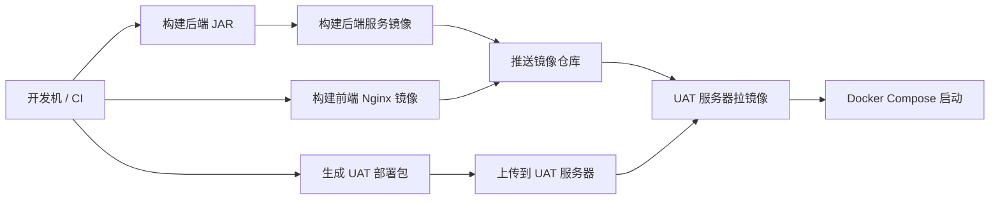

# KPM 部署说明（UAT / 测试环境）

本文档描述 KPM 推荐的 UAT 部署方式：**构建产物在开发机或 CI 完成，UAT 服务器只拉取镜像并启动容器**。服务器不需要拉源码，也不需要安装 Maven、Node.js 或 JDK。

## 1. 部署方式选择

当前推荐方式是 Docker 镜像式部署：



这种方式更接近真实测试环境：

- UAT 服务器运行的是明确版本的镜像，不是临时源码；
- 前端是构建后的静态文件，由 Nginx 托管；
- 后端是构建后的 Spring Boot JAR，被封装进服务镜像；
- 服务器只保留 compose、env、数据库初始化 SQL 和配置发布脚本；
- 后续接入 GitHub Actions 后，可以自动构建并发布同样的镜像。

## 2. 镜像命名

默认镜像仓库：

```bash
ghcr.io/kozensupport
```

默认镜像包括：

| 镜像 | 说明 |
|---|---|
| `kpm-frontend` | 内部系统 + 客户门户前端，Nginx 托管 |
| `kpm-gateway` | API Gateway |
| `kpm-iam-service` | 用户、认证、权限 |
| `kpm-resource-service` | 资源枚举、菜单按钮权限目录 |
| `kpm-project-service` | 项目、阶段、SKU、项目资料、公告 |
| `kpm-customer-service` | 客户、联系人、客户门户、知识库 |
| `kpm-task-service` | 任务、工单、留言、附件 |
| `kpm-order-service` | 订单、订单修改记录 |
| `kpm-file-service` | 文件上传下载、OSS |
| `kpm-analytics-service` | 统计看板 |
| `kpm-integration-service` | 第三方集成预留 |
| `kpm-notification-service` | 系统消息、通知、邮件预留 |

## 3. 开发机 / CI：构建并推送镜像

如果使用 GitHub Container Registry，先登录：

```bash
docker login ghcr.io
```

然后在项目根目录执行：

```bash
cd /Users/henry/Documents/KPM
bash scripts/uat-build-images.sh --registry ghcr.io/kozensupport --tag uat-20260706 --push
```

也可以不指定 tag，脚本默认使用当前 Git 短 SHA：

```bash
bash scripts/uat-build-images.sh --push
```

脚本会：

1. 使用 Maven Docker 镜像构建所有后端 JAR；
2. 为每个后端微服务构建运行时镜像；
3. 构建前端 Nginx 镜像；
4. 按需推送到镜像仓库；
5. 将最近一次镜像信息写入 `.release/last-uat-images.env`。

> 前端 UAT 镜像默认使用同源 `/api`，由 Nginx 反向代理到 Gateway，因此部署到不同服务器时通常不需要重新构建前端。

## 4. 开发机 / CI：生成 UAT 部署包

```bash
bash scripts/uat-package-release.sh --registry ghcr.io/kozensupport --tag uat-20260706
```

生成结果类似：

```text
.release/kpm-uat-uat-20260706.tar.gz
```

部署包只包含：

```text
.env.example
VERSION
infra/docker-compose/uat/docker-compose.yml
infra/database/schema.sql
infra/database/seed.sql
scripts/nacos-publish-service-configs.sh
scripts/uat-server-deploy.sh
docs/05-delivery/deployment.md
```

不会包含前端源码、后端源码、`node_modules`、`target` 等开发内容。

## 5. UAT 服务器：部署

把部署包上传到服务器后：

```bash
tar -xzf kpm-uat-uat-20260706.tar.gz
cd kpm-uat-uat-20260706
cp .env.example .env
vim .env
bash scripts/uat-server-deploy.sh
```

服务器需要安装：

- Docker
- Docker Compose v2
- curl

不需要安装：

- JDK
- Maven
- Node.js
- npm

## 6. `.env` 中建议重点检查的配置

```bash
KPM_IMAGE_REGISTRY=ghcr.io/kozensupport
KPM_IMAGE_TAG=uat-20260706

KPM_PUBLIC_PROTOCOL=http
KPM_PUBLIC_HOST=<UAT服务器IP或域名>

KPM_DB_NAME=kpm
KPM_DB_USER=kpm
KPM_DB_PASSWORD=<强密码>

KPM_AUTH_TOKEN_SECRET=<强随机字符串>

KPM_OSS_ENABLED=true
KPM_OSS_ENDPOINT=https://oss-cn-shanghai.aliyuncs.com
KPM_OSS_BUCKET=xc-kozen-sh-fw
KPM_OSS_ROOT_PREFIX=KPM/
KPM_OSS_ACCESS_KEY_ID=<不要提交到Git>
KPM_OSS_ACCESS_KEY_SECRET=<不要提交到Git>
```

OSS、邮箱、日志等级等运行配置会由 `scripts/nacos-publish-service-configs.sh` 发布到 Nacos。

## 7. 常用部署命令

正常部署或升级：

```bash
bash scripts/uat-server-deploy.sh
```

不拉取镜像，仅重启本地已有镜像：

```bash
bash scripts/uat-server-deploy.sh --no-pull
```

启用 SkyWalking：

```bash
bash scripts/uat-server-deploy.sh --observability
```

启用 RocketMQ profile：

```bash
bash scripts/uat-server-deploy.sh --mq
```

重置数据库（危险，会清空业务数据）：

```bash
bash scripts/uat-server-deploy.sh --reset-db
```

## 8. 默认访问地址

假设 `.env` 中：

```bash
KPM_PUBLIC_PROTOCOL=http
KPM_PUBLIC_HOST=192.168.1.100
KPM_FRONTEND_PORT=14173
KPM_GATEWAY_PORT=19080
KPM_NACOS_CONSOLE_PORT=18849
KPM_SKYWALKING_UI_PORT=19081
```

则地址为：

| 页面 | 地址 |
|---|---|
| 内部系统 | `http://192.168.1.100:14173/#/login` |
| 客户门户 | `http://192.168.1.100:14173/#/customer-login` |
| Gateway API | `http://192.168.1.100:19080` |
| Nacos Console | `http://192.168.1.100:18849/` |
| SkyWalking UI | `http://192.168.1.100:19081/` |

默认管理员：

```text
admin@kozenmobile.com / 123456
```

## 9. 数据库初始化策略

首次启动 PostgreSQL 空数据卷时，compose 会自动执行：

```text
infra/database/schema.sql
infra/database/seed.sql
```

如果数据库卷已存在，脚本会检查 `kpm_users` 表是否存在：

- 已存在：跳过初始化，保护已有数据；
- 不存在：执行 schema + seed；
- 指定 `--reset-db`：强制执行 schema + seed，会删除旧业务数据。

## 10. Nacos 配置策略

UAT 部署时会自动启动一次性容器 `kpm-uat-nacos-config-publisher`，执行：

```bash
scripts/nacos-publish-service-configs.sh
```

该脚本会发布各微服务配置，包括：

- 服务端口；
- 数据库连接；
- Valkey / Redis 连接；
- Token secret；
- OSS 配置；
- 邮件配置；
- 日志等级与 500 错误告警阈值；
- 统计缓存 TTL；
- 地理编码配置。

如果 `.env` 中填写了 OSS secret，脚本会在部署包目录下的 `.local/nacos/configs/` 做本地备份，便于 Nacos 容器重建后重新发布。该目录不会进入 Git。

## 11. 升级流程

推荐升级流程：

1. 开发机/CI 构建新 tag 镜像并推送；
2. 生成新的 UAT 部署包；
3. 上传部署包到服务器；
4. 复制旧 `.env` 到新部署包目录；
5. 修改 `.env` 中 `KPM_IMAGE_TAG`；
6. 执行：

```bash
bash scripts/uat-server-deploy.sh
```

## 12. 回滚流程

如果旧镜像 tag 仍在仓库中，可以在 UAT 服务器 `.env` 中改回旧 tag：

```bash
KPM_IMAGE_TAG=<previous-tag>
```

然后执行：

```bash
bash scripts/uat-server-deploy.sh
```

如果数据库结构已经发生不可逆迁移，回滚前必须先确认数据库兼容性。
