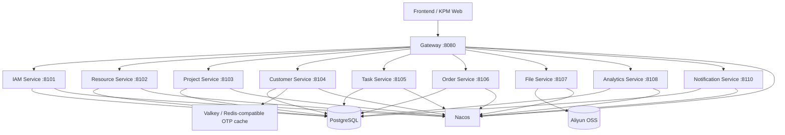

# KPM（Kozen Project Management）项目介绍

更新时间：2026-06-05
工作目录：`/Users/henry/Documents/KPM`


## 0. 2026-06-05 最新维护记录：统计准确性、日志与可观测性

本轮重点完成“统计可信、日志安全、可观测性可落地”的维护工作：

- 修复工作台任务统计口径：工作台不再从前端已加载的前 20 条任务中自行计算，而是调用后端 `GET /api/tasks/stats`，由数据库按当前登录用户完整统计任务总数、我正在执行、等待他人、已完成。
- 已验证 Henry 账号数据口径：统计接口返回 `total=14 / mine=11 / waiting=0 / completed=3`，与任务分页接口对应筛选后的 `total` 一致。
- 任务列表增加“重置筛选”入口：从工作台点击数字跳转到任务列表后，可以一键清空 URL 查询参数与页面筛选条件。
- 内部系统默认中文环境，客户门户默认英文环境；两个登录页左侧主体标题固定展示英文：`Project Management` 与 `Customer Portal`。客户门户登录表单标题统一为“登录/Login”。
- 后端公共日志能力已集成到 `kpm-common`：
  - Controller AOP 打印接口路由、入参、耗时和返回摘要；
  - Service AOP 打印业务服务调用耗时，Debug 级别可输出入参/返回；
  - 全局异常处理统一兜底 500，并记录错误爆发情况；
  - 日志自动携带 `X-KPM-Trace-Id`，便于跨服务排查；
  - 敏感字段脱敏，覆盖 password、secret、token、authorization、accessKey 等；本地旧 token 日志已清空。
- 日志滚动归档已配置：日志写入 `/Users/henry/Documents/KPM/apps/backend/logs`，按时间和大小切分，默认保留最近 10 份，避免长期占用磁盘。
- 日志等级、payload 长度、500 爆发邮件提醒阈值等已统一进入 Nacos 配置，可通过 `scripts/nacos-publish-service-configs.sh` 发布。
- 新增统计相关索引迁移：`infra/database/migrations/20260605_analytics_task_stats_indexes.sql`，覆盖任务统计、任务执行人/参与人、订单统计、客户活跃度、客户负责人、客户项目关联等高频查询场景。该迁移已应用到当前本地数据库，并同步写入 `infra/database/schema.sql`。
- SkyWalking 已接入 Docker Compose 的可选 `observability` profile：默认不启用，避免增加本机资源占用；需要链路追踪时再启用。

### SkyWalking 本地启用方式

默认开发模式不会加载 SkyWalking agent。如果需要排查链路问题，可按以下方式启动：

```bash
cd /Users/henry/Documents/KPM
# 1. 在 .env 中开启 Java Agent
# KPM_SKYWALKING_JAVA_AGENT_OPTIONS=-javaagent:/skywalking-agent/skywalking-agent.jar

# 2. 启动观测组件和业务服务
docker compose -f infra/docker-compose/dev/docker-compose.yml --profile observability up -d

# 3. 访问 SkyWalking UI
open http://127.0.0.1:19081
```

说明：SkyWalking OAP 端口为 `11800/12800`，UI 端口为 `19081`。生产环境建议配合统一日志采集（Grafana Loki 或 OpenSearch）一起使用：SkyWalking 负责链路追踪，Loki/OpenSearch 负责日志检索与告警。

### 本轮验证结果

- 后端全量构建通过：`mvn -DskipTests package`。
- 11 个后端微服务重启后均正常运行，无 `APPLICATION FAILED`、`ERROR` 或启动异常。
- 关键接口已验证：登录、任务统计、任务分页、订单统计、资源地图、技术支持统计、客户活跃度统计均返回成功。
- 日志文件已验证：请求日志、业务耗时日志、traceId 均可见；登录返回中的 token 已脱敏，日志中未再出现 `kpm1.` 明文 token。
- 前端生产构建已通过，`http://127.0.0.1:14173/index.html` 可返回最新构建资源。

## 0. 2026-06-04 当前最新状态

本轮已完成以下修正和迁移：

- 恢复项目详情中的「阶段详情」入口：阶段详情支持阶段资料库上传/下载、发布到项目资料区二次确认、阶段留言/记录、从阶段直接弹窗新建任务。
- 恢复项目详情「关联客户」中的客户需求入口：可查看客户需求列表，并支持新增、作废、删除需求及跳转关联任务。
- 客户详情补齐客户资料上传/下载入口；新增跟进记录支持附件上传。
- 统计看板继续按二级菜单拆分：订单情况、技术支持情况、资源分布、客户×项目活跃度。
- 技术支持情况、地图数据明细增加客户/人员/地区/项目搜索筛选。
- 客户×项目活跃度改为真正的矩阵：横轴项目、纵轴客户；交叉点按最近订单或任务时间判定活跃度：30 天内活跃，31-90 天不活跃，91-365 天异常，超过 365 天视为该客户已放弃该产品；点击单元格显示对应销售与任务明细。
- 工作台任务统计和任务列表筛选统一口径：任务总数、我正在执行、等待他人三张卡片点击后的列表数量与卡片统计一致。
- 完成全库 BIGINT 技术主键迁移：所有主业务表 `id` 及关联外键改为 `BIGINT GENERATED BY DEFAULT AS IDENTITY`；后端 API 仍以字符串形式序列化 ID，避免前端 JavaScript 精度问题。
- 后端新建 ID 已统一为纯数字字符串；客户简称、任务编号等业务展示字段与数据库技术主键分离。
- 项目详情「项目资料」新增直接上传入口；项目资料支持二次确认后标记为“公开给客户”，公开资料会进入客户门户。
- 新增客户门户：客户联系人以邮箱为账号，通过动态验证码登录；验证码采用 Redis/Valkey 临时存储，10 分钟过期，不再落 PostgreSQL；登录后可查看关联项目公开资料、下载资料、查看客户任务进度，并可创建任务自动分配给客户技术支持负责人。
- 客户门户 token 有效期为 8 小时，并实现滑动刷新：客户持续操作时后端会在响应头返回新 token；长期无操作则自然过期。
- KPM 内部登录 token 有效期调整为 2 小时，并在 Gateway 对每次有效 API 请求返回 `X-KPM-Refresh-Token`，前端自动替换本地 token；用户持续操作则不过期，长时间无操作需要重新登录。
- 项目主信息中的“是否可销售/不可销售原因”已删除；项目状态只由各阶段状态表达，相关前端展示、后端字段、数据表字段和可用枚举均已移除。
- 项目详情新增「发布公告」：发布前二次确认；确认后写入项目公告表，并同步给项目关联客户联系人生成客户门户消息。客户登录门户后，公告会在顶部滚动/卡片区展示，右上角消息盒子也能看到公告和后续任务更新。
- 任务留言已区分「内部留言」和「外部留言」：内部留言只在 Kozen 内部任务详情展示；外部留言会同步到客户门户。内部用户发布外部留言时，会给客户联系人生成门户系统消息，并写入客户邮件 outbox 表，邮箱真实发送能力先预留，待邮箱配置完成后再开启测试。
- 客户门户任务详情已支持查看外部留言，并允许客户联系人新增留言；客户新增留言默认按外部留言处理，Kozen 内部任务详情同步可见，并向对应技术支持负责人生成内部通知。
- 项目资料区新增「资料描述」字段，用于说明文件内容；公开给客户的项目资料在客户门户中也会展示该描述。
- 中英文国际化已恢复：登录页、客户门户登录页、主布局和核心导航采用 i18n key；历史页面先通过 DOM 兼容翻译层覆盖常见按钮、表头、状态和提示。后续建议逐页把兼容层替换为完整 key 化实现。
- 当前本地数据库保留一批用于试用和统计看板验证的演示数据；管理员账号仍可用于继续录入和验证。

管理员账号：`admin@kozenmobile.com`  
默认密码：`123456`

## 1. 2026-06-04 后端与运行环境巡检结论

本轮针对所有后端服务、日志和本地部署链路做了完整巡检与修复：

- 后端全量构建通过：在 Docker Maven 环境执行 `./mvnw test` 与 `./mvnw -DskipTests package` 成功。
- 11 个后端服务均可启动，`/actuator/health` 全部返回 `UP`，Swagger `/v3/api-docs` 全部返回 `200`。
- 文件服务已在 compose 环境完成真实 OSS 上传冒烟测试，上传路径位于 `oss://xc-kozen-sh-fw/KPM/general/...`。
- 统计服务、通知服务进一步从 `Map<String,Object>` 重构为 Entity / DTO / Converter 风格；业务接口返回结构更清晰，Swagger 文档更准确。
- Gateway 已加入 Caffeine 依赖，消除 Spring Cloud LoadBalancer 默认缓存的生产化 warning。
- Nacos、数据库、服务端口、OSS、通知刷新间隔等配置已由 `scripts/nacos-publish-service-configs.sh` 统一发布到 Nacos；OSS secret 会通过 `.local/nacos/configs` 做本地安全备份，避免 Nacos 容器重建后丢失。
- 新增一键启动/停止脚本：`scripts/dev-full-up.sh`、`scripts/dev-full-down.sh`。
- 当前本机 Docker 内存约 3.8GiB，已通过降低 Nacos/JVM/Hikari 配置保证能启动；长期稳定开发建议 Docker Desktop 分配至少 6GiB 内存。

## 2. 项目定位

KPM 是 Kozen 内部使用的产品项目协作系统，目标是把 POS 产品从立项、研发、测试、客户推广、订单、交付、维护过程中的项目信息、客户信息、任务、资料、订单和统计统一到一个系统里。

当前版本定位为 **可试点版本**，不是正式生产终态。它已经具备核心试用能力，但从优秀 CTO/架构负责人视角看，仍需要继续补齐自动化测试、前端工程化拆分、完整 OAuth2/SSO 能力、消息 MQ 化、生产级高可用部署和观测体系。

## 3. 当前已完成/落实的能力

### 3.1 前端页面与交互

- 登录页已调整为科技风视觉，展示 KOZEN slogan：`KOZEN, TO COLLABORATE WITH GLOBAL LEADERS`。
- 左侧菜单支持收缩/展开，为主内容区释放空间。
- 顶部保留消息盒子；用户菜单移动到左下角头像入口，并在头像下方展示当前登录用户名。
- 权限授予支持一次性多选，避免逐个点击。
- 客户、任务、项目成员、负责人等人员选择改为搜索式选择，不允许把不存在的人员直接落库。
- 项目创建成功后返回项目列表，避免停留空白页。
- 任务支持客户字段；未指定客户时表示“中性/适用于所有客户”。
- 统计看板已拆成二级菜单：订单情况、技术支持情况、资源分布、客户×项目活跃度，避免所有统计堆在同一个页面。
- 订单统计使用 ECharts，可按销售额/订单数/产品数切换指标，并支持柱状图、折线图、饼图形态。
- 资源分布已接入 MapLibre GL JS，在真实地图上展示客户地理位置、销售/技术支持与项目资源分布。
- 客户简称是业务展示短码：添加客户时必须填写 1-5 位英文字母，系统统一转大写并做唯一性校验。
- 任务展示编号使用 `taskNo`：有关联客户时为“客户简称 + 全局自增序列”，无客户时为 `N + 全局自增序列`；数据库技术主键不在前端展示。
- 订单增加状态、SKU 选择、订单详情展示；列表只展示基础信息，详情页展示完整信息，避免表格变形。
- 项目详情增加 SKU 管理入口，当前 SKU 字段：整机料号、配置名称、内存类型。
- 任务长标题在列表中做省略展示，避免撑坏 UI。
- 页面已恢复中文/英文切换能力；当前采用“核心页面 key 化 + 历史页面 DOM 兼容层”的过渡方案，适合试点阶段验证语言切换，后续生产化建议逐页完成完整 key 化。

### 3.2 后端与数据联动

- 后端已从早期 Controller/Map 直写逐步重构为 Controller / Service / ServiceImpl / Mapper 分层；IAM 和资源管理服务已开始落实 Entity / DTO / Converter 边界。
- Mapper 已切换到 MyBatis 注解 SQL，不再依赖原来的 JDBC Map Mapper。
- 新增订单状态枚举，资源管理中可配置，并可被订单实际使用。
- 新增项目 SKU 表，订单下单时选择 SKU，并保存 SKU 快照。
- OSS 文件上传已经接入真实阿里云 OSS，根目录为 `oss://xc-kozen-sh-fw/KPM/`。
- 文件下载链接使用 OSS 签名 URL，并强制 `Content-Disposition: attachment`，避免 txt 等文件直接在浏览器打开。
- 消息增加已读/未读状态；已读消息超过 15 天会逻辑删除。
- 主业务表删除逐步统一为 `del_flag=1` 逻辑删除，列表/详情查询按 `del_flag=0` 过滤。
- 数据库技术主键已迁移为 `BIGINT GENERATED BY DEFAULT AS IDENTITY`；前端仍按字符串处理 ID，避免 JS 大整数精度风险。
- 项目资料和阶段资料均支持保存文件描述/备注；阶段资料发布到项目资料区时会带上描述。
- 任务留言已增加 `comment_type`：`internal` 表示内部留言，`external` 表示外部留言。客户门户只读取 `external` 留言；内部任务详情可同时查看两类留言。
- 内部用户新增外部留言时，系统会写入 `kpm_customer_portal_messages`，并同步写入 `kpm_customer_email_outbox` 作为邮件发送预留队列；客户在门户新增留言时，会写入外部留言并生成内部通知事件。


### 3.3 本地数据状态

当前本地数据库保留演示数据，用于验证项目、客户、订单、任务、统计看板、客户门户公开资料、公告和消息盒子等功能链路。若需要重新开始手动录入测试，可执行清理脚本：

```bash
cd /Users/henry/Documents/KPM
./scripts/db-clear-for-manual-test.sh
```

该脚本会清空项目、客户、任务、订单等业务数据，仅保留系统基础配置、权限、枚举、流程模板和管理员账号。

管理员账号：`admin@kozenmobile.com`
默认密码：`123456`

### 3.4 代码质量优化推进记录

本轮已开始按“望文生义、层次清晰、方便维护”的标准推进代码优化：

- IAM 服务已拆出 `entity / dto / converter / service / mapper` 边界，登录和当前用户接口不再返回裸 `Map`，避免密码 hash 等持久化字段误穿透到前端。
- 资源管理服务已把用户、部门、角色、权限、枚举、任务状态流转的返回结构 DTO 化，并通过 Converter 从 Mapper 实体转换为 API DTO。
- 任务服务已拆出 `TaskEntity / TaskDto / TaskWriteCommand / TaskConverter`，任务 CRUD、附件、评论接口不再用裸 `Map` 作为主要返回结构，任务创建/修改也不再依赖 `TaskRequest.toMap()`。
- 用户-部门、用户-角色、用户直授权限、角色权限、任务执行人、任务参与者关系由物理删除调整为逻辑删除 + `on conflict` 恢复，符合 KPM 当前“不物理删除业务数据”的审计要求。
- 修复 IAM 密码更新 SQL 使用非标准 `updated_at` 的问题，统一使用公共字段 `update_time`。
- 已完成后端全量构建、前端构建、登录/当前用户/资源启动数据/任务创建详情删除接口烟测。
- 订单服务已拆出 `OrderEntity / OrderHistoryEntity / ProjectSkuEntity / UserLookupEntity`、`OrderDto / OrderHistoryDto / OrderSkuSnapshotDto / OrderWriteCommand`、`OrderConverter`，Controller/Service 不再返回裸 `Map`，Mapper 查询 SQL 改为显式 alias，降低字段映射导致前端 `undefined` 的风险。
- 前端 API client 已优化错误信息处理，优先展示后端标准 `ApiResponse.message/code`，并避免 FormData/GET 请求被错误设置 JSON Content-Type。
- 后端已新增 Maven Wrapper，可在 `apps/backend` 下通过 `./mvnw test` 进行可复现构建；当前也已验证 Docker Maven 容器执行 wrapper 成功。
- 本轮新增代码质量审查记录：`docs/04-development/code-quality-audit-20260603.md`。

仍需继续优化的重点：项目、客户、统计、通知等服务中仍存在部分 `Map` 查询投影或返回；订单服务已完成本轮 `Entity + DTO + Converter + Bean Validation` 边界重构，后续重点应转向项目服务进一步 DTO 化、复杂 SQL XML 化、前端页面继续细粒度组件拆分和 bundle 优化。


## 4. 技术架构方案

### 4.1 技术栈

| 层级 | 当前技术 | 说明 |
|---|---|---|
| JDK | Eclipse Temurin / Java 21 LTS | 免费 JDK，适合长期维护。 |
| 后端框架 | Spring Boot 4 / Spring Cloud Gateway | 微服务 + 网关模式。 |
| 配置中心/注册中心 | Nacos 3.1.1 | 服务配置、服务发现。 |
| 数据库 | PostgreSQL 18 | 免费开源；适合复杂业务关系和统计查询。 |
| ORM/SQL | MyBatis | 当前采用注解 SQL；后续建议复杂 SQL 迁移 XML 或 DSL。 |
| 文件存储 | 阿里云 OSS | 文件上传/下载真实落 OSS。 |
| 缓存 | Valkey | 免费 Redis 兼容方案；当前用于客户门户验证码、资源启动数据缓存、统计看板缓存。缓存 TTL 与抖动参数由 Nacos/env 管理。 |
| 消息 | 当前为 DB 事件表；RocketMQ Compose profile 已预留 | V1 先用 `kpm_notification_events` 表驱动内部消息；生产建议正式接入 MQ。 |
| 前端 | Vite + React + Ant Design + ECharts + MapLibre GL JS | 当前已从 prototype runtime 迁移到正式 React 页面、组件、hooks、types、services 分层；后续继续做组件级拆分和 bundle 优化。 |
| 接口文档 | SpringDoc Swagger | 每个后端服务暴露 `/swagger-ui.html` 与 `/v3/api-docs`。 |
| 容器部署 | Docker Compose | 已统一到一个 compose 文件和 `.env` 配置。 |

### 4.2 微服务划分



## 5. 关键访问地址

本地开发环境：

| 功能 | 地址 |
|---|---|
| 前端 Vite Preview | `http://127.0.0.1:14173/` |
| Gateway | `http://127.0.0.1:19080` |
| Nacos API | `http://127.0.0.1:18848` |
| Nacos Console | `http://127.0.0.1:18849/` |
| Swagger 示例 | `http://127.0.0.1:19101/swagger-ui.html` |

> 注意：KPM 本地宿主机端口已迁移到独立端口段，避免与 API Manager 或其他本地项目冲突。容器内部端口不变，例如 Gateway 容器内仍是 `8080`，宿主机访问改为 `19080`。
> 注意：Nacos 3 的控制台端口映射为 `18849`，路径是 `/`，不是旧版本的 `/nacos/`。

## 6. 部署与本地启动

### 6.1 本地开发启动

本地开发和联调使用统一 compose：

```bash
cd /Users/henry/Documents/KPM
cp .env.example .env
./scripts/dev-full-up.sh
```

停止整套本地环境：

```bash
./scripts/dev-full-down.sh
```

本地访问：

| 页面 | 地址 |
|---|---|
| 内部系统 | `http://127.0.0.1:14173/#/login` |
| 客户门户 | `http://127.0.0.1:14173/#/customer-login` |
| Gateway | `http://127.0.0.1:19080` |
| Nacos Console | `http://127.0.0.1:18849/` |

说明：

- `dev-full-up.sh` 会启动 PostgreSQL、Valkey、Nacos、配置发布器、11 个后端服务、Gateway 和前端预览服务。
- Nacos、数据库、OSS、邮箱、日志等级、缓存 TTL 等配置由 `scripts/nacos-publish-service-configs.sh` 统一发布。
- OSS 密钥、邮箱密码等敏感信息只允许放在 `.env` 或 Nacos，不进入 Git。

### 6.2 UAT 部署方式

UAT 已调整为镜像式部署：开发机或 CI 负责构建镜像，UAT 服务器只拉取镜像并启动容器，不再拉源码、不在服务器编译。

开发机/CI 构建并推送镜像：

```bash
bash scripts/uat-build-images.sh --registry ghcr.io/kozensupport --tag <release-tag> --push
```

生成部署包：

```bash
bash scripts/uat-package-release.sh --registry ghcr.io/kozensupport --tag <release-tag>
```

UAT 服务器部署：

```bash
tar -xzf kpm-uat-<release-tag>.tar.gz
cd kpm-uat-<release-tag>
cp .env.example .env
vim .env
bash scripts/uat-server-deploy.sh
```

部署包只包含 compose、env 模板、数据库初始化 SQL、Nacos 配置发布脚本和部署脚本，不包含前后端源码。完整说明见 `/Users/henry/Documents/KPM/docs/05-delivery/deployment.md`。

### 6.3 常用维护脚本

```bash
# 检查本地开发依赖
./scripts/dev-env-check.sh

# 单独启动基础设施
./scripts/dev-infra-up.sh

# 构建后端
./scripts/backend-build-docker.sh

# 手工重新发布 Nacos 配置
./scripts/nacos-publish-service-configs.sh

# 清空业务数据，只保留管理员和基础配置
./scripts/db-clear-for-manual-test.sh
```

## 7. 前后端如何通信

### 7.1 调用方式

前端通过 `/Users/henry/Documents/KPM/apps/frontend/kpm-web/src/services/kpmApi.ts` 与 `/Users/henry/Documents/KPM/apps/frontend/kpm-web/src/api/httpClient.ts` 调用后端：

- JSON 接口：`fetch + application/json`
- 文件上传：`multipart/form-data`
- 鉴权头：`Authorization: Bearer <token>`
- 开发环境 API Base：默认 `http://127.0.0.1:19080`

### 7.2 鉴权与权限

当前是轻量级 Bearer Token + Gateway RBAC：

- 登录接口：`POST /api/iam/login`
- 登录后返回 token、用户信息、角色和权限。
- KPM 内部 token 默认有效期 2 小时；Gateway 验证 token 后会在响应头返回 `X-KPM-Refresh-Token`，前端 `httpClient` 自动更新本地 token，实现“持续操作自动续期，长时间无操作过期重登”。
- Gateway 验证 token 并注入用户上下文。中文用户名在服务间传递时额外使用 `X-KPM-User-Name-Base64`，避免 HTTP header 编码导致发布人显示乱码。
- 菜单权限和按钮权限由后端权限表生成，前端按权限隐藏入口，后端 Gateway 继续做真实权限校验。

客户门户使用独立但兼容的轻量 token：

- 验证码不建表，发送验证码时生成 6 位字母数字组合，只把 hash 写入 Valkey：`kpm:customer-portal:otp:<email>`，TTL 10 分钟。
- 验证成功后删除验证码 key，并签发 8 小时客户门户 token。
- 客户门户 `/me`、`/data`、`/tasks`、`/messages` 等接口都会返回 `X-KPM-Refresh-Token`，前端自动续期。

当前还不是完整 OAuth2 Authorization Server。生产建议：

1. 引入 Spring Authorization Server 或 Keycloak。
2. 使用标准 OAuth2/OIDC token。
3. 对 token 增加刷新、吊销、设备管理和审计。
4. 将 Gateway RBAC 继续作为接口级权限边界。

### 7.3 数据校验

当前已有两层校验：

- 前端：必填、邮箱格式、长度、人员选择必须来自已有用户、提交/删除二次确认、toast 分级提示。
- 后端：DTO + Bean Validation + `ValidationUtil` + 全局异常处理。

仍需继续加强：

- SQL 层唯一性和外键完整性。
- DTO 覆盖率还要继续提高，部分接口仍有 Map 参数或 Map 返回。
- 文件 MIME/扩展名安全策略可进一步细化。

## 8. 数据库设计摘要

### 8.1 公共字段标准

当前所有 `kpm_%` 表通过 schema/migration 补充了公共字段：

| 字段 | 说明 |
|---|---|
| `id` | BIGINT 技术主键，数据库定义为 `BIGINT GENERATED BY DEFAULT AS IDENTITY PRIMARY KEY`；API 为避免 JS 精度问题仍按字符串序列化。 |
| `creator` | 创建者 ID/标识。 |
| `updator` | 修改者 ID/标识。 |
| `create_time` | 创建时间。 |
| `update_time` | 最后修改时间。 |
| `del_flag` | 逻辑删除标记，`0` 存在，`1` 删除。 |

当前规则：客户简称、任务编号等业务展示编号独立存放在 `short_name`、`task_no` 等字段，不再复用数据库技术主键。

### 8.2 表结构清单

以下为当前本地 PostgreSQL 中的主要表和字段摘要：

| 表名 | 说明 | 主要字段 |
|---|---|---|
| `kpm_users` | 用户 | `id`, `account`, `email`, `name`, `password_hash`, `status`, 公共字段 |
| `kpm_departments` | 部门 | `id`, `name`, `status`, 公共字段 |
| `kpm_roles` | 角色 | `id`, `name`, `role_type`, `status`, 公共字段 |
| `kpm_permissions` | 菜单/按钮权限 | `id`, `code`, `name`, `permission_type`, `target`, `location`, 公共字段 |
| `kpm_user_departments` | 用户-部门关系 | `user_id`, `department_id`, 公共字段 |
| `kpm_user_roles` | 用户-角色关系 | `user_id`, `role_id`, 公共字段 |
| `kpm_user_permissions` | 用户直接权限 | `user_id`, `permission_id`, 公共字段 |
| `kpm_role_permissions` | 角色权限 | `role_id`, `permission_id`, 公共字段 |
| `kpm_enum_items` | 资源枚举 | `id`, `enum_type`, `name`, `value`, `semantic`, `active`, `sort_order`, 公共字段 |
| `kpm_projects` | 项目主表 | `id`, `external_name`, `internal_name`, `model_name`, `manager_user_id`, `manager_account`, `archived`, 公共字段；项目总体状态不再单独存储，由阶段状态体现 |
| `kpm_project_stages` | 项目阶段 | `id`, `project_id`, `stage_name`, `stage_order`, `status`, 公共字段 |
| `kpm_stage_assignees` | 阶段负责人 | `id`, `stage_id`, `assignee_type`, `assignee_name`, `account`, `user_id`, 公共字段 |
| `kpm_stage_materials` | 阶段资料 | `id`, `stage_id`, `file_name`, `description`, `bucket`, `object_key`, `storage_url`, `published_to_project`, 公共字段 |
| `kpm_stage_records` | 阶段留言/记录 | `id`, `stage_id`, `author`, `content`, `attachments`, 公共字段 |
| `kpm_project_materials` | 项目资料区 | `id`, `project_id`, `source_stage`, `file_name`, `description`, `bucket`, `object_key`, `storage_url`, `public_visible`, `public_at`, 公共字段 |
| `kpm_project_announcements` | 项目公告 | `id`, `project_id`, `title`, `content`, `publisher`, `published_at`, 公共字段 |
| `kpm_project_members` | 项目成员 | `id`, `project_id`, `user_id`, `user_account`, `role_name`, 公共字段 |
| `kpm_project_skus` | 项目 SKU | `id`, `project_id`, `whole_machine_part_number`, `configuration_name`, `memory_type`, `active`, 公共字段 |
| `kpm_project_customers` | 项目-客户关联 | `id`, `project_id`, `customer_id`, `project_status`, 公共字段 |
| `kpm_customers` | 客户主表 | `id`, `name`, `short_name`, `region`, `address`, `level`, `status`, 公共字段 |
| `kpm_customer_owners` | 客户负责人 | `id`, `customer_id`, `owner_type`, `owner_user_id`, `owner_name`, 公共字段 |
| `kpm_customer_contacts` | 客户联系人 | `id`, `customer_id`, `name`, `title`, `phone`, `email`, `remark`, 公共字段 |
| `kpm_customer_materials` | 客户资料 | `id`, `customer_id`, `file_name`, `bucket`, `object_key`, `storage_url`, 公共字段 |
| `kpm_customer_followups` | 客户跟进记录 | `id`, `customer_id`, `author`, `content`, `attachments`, 公共字段 |
| `kpm_customer_portal_messages` | 客户门户消息 | `id`, `customer_id`, `contact_id`, `contact_email`, `title`, `content`, `message_type`, `project_id`, `task_id`, `announcement_id`, `read_flag`, `read_at`, 公共字段 |
| `kpm_customer_email_outbox` | 客户邮件发送预留队列 | `id`, `recipient_email`, `recipient_name`, `subject`, `content`, `message_type`, `related_project_id`, `related_task_id`, `status`, `last_error`, `sent_at`, 公共字段 |
| `kpm_requirements` | 客户需求 | `id`, `project_id`, `customer_id`, `title`, `user_story`, `business_value`, `acceptance`, `priority`, `status`, `task_id`, 公共字段 |
| `kpm_tasks` | 任务 | `id`, `task_no`, `title`, `description`, `project_id`, `stage_id`, `customer_id`, `category`, `status`, `priority`, `creator_user_id`, `expected_completion_at`, `blocked`, 公共字段 |
| `kpm_task_assignees` | 任务执行人 | `task_id`, `user_id`, `assignee_name`, 公共字段 |
| `kpm_task_participants` | 任务参与人 | `task_id`, `user_id`, `participant_name`, 公共字段 |
| `kpm_task_attachments` | 任务附件 | `id`, `task_id`, `file_name`, `bucket`, `object_key`, `storage_url`, 公共字段 |
| `kpm_task_comments` | 任务评论 | `id`, `task_id`, `author`, `comment_type`, `content`, `attachments`, 公共字段；`comment_type=internal/external` |
| `kpm_task_status_transitions` | 任务状态流转配置 | `id`, `from_status`, `to_status`, 公共字段 |
| `kpm_orders` | 订单 | `id`, `order_date`, `customer_id`, `project_id`, `sku_id`, `sku_snapshot`, `order_type`, `status`, `quantity`, `expected_ship_date`, `actual_ship_date`, `currency`, `unit_price`, `amount`, `creator_user_id`, 公共字段 |
| `kpm_order_histories` | 订单修改记录 | `id`, `order_id`, `modifier`, `modified_at`, `changes`, `reason`, 公共字段 |
| `kpm_notification_events` | 通知事件 | `id`, `event_type`, `aggregate_type`, `aggregate_id`, `recipient_user_ids`, `payload`, `status`, `processed_at`, 公共字段 |
| `kpm_internal_messages` | 内部消息 | `id`, `recipient_user_id`, `title`, `content`, `message_type`, `read_flag`, `read_at`, `del_flag` |
| `kpm_geocode_cache` | 地址转经纬度缓存 | `query`, `latitude`, `longitude`, `display_name`, `provider`, `precision`, 公共字段 |
| `kpm_process_templates` | 流程模板 | `id`, `name`, `scope`, `status`, `updated_at`, 公共字段 |
| `kpm_template_stages` | 模板阶段 | `id`, `template_id`, `stage_name`, `sort_order`, 公共字段 |
| `kpm_prototype_snapshots` | 原型状态快照 | `id`, `state`, `updated_by`, `updated_at`, 公共字段 |

## 9. 配置中心与 OSS

### 9.1 Nacos 管理内容

Nacos 中维护每个服务的：

- 服务端口。
- 数据库连接。
- Gateway CORS / IAM URI / 鉴权开关。
- 文件服务 OSS 配置。
- 通知服务刷新频率、邮件配置。
- 统计服务地理编码配置。

### 9.2 OSS 状态

文件服务读取 Nacos 中的：

```yaml
kpm:
  oss:
    enabled: true
    endpoint: ...
    bucket: xc-kozen-sh-fw
    root-prefix: KPM/
    access-key-id: <由 Nacos 管理，不提交 Git>
    access-key-secret: <由 Nacos 管理，不提交 Git>
```

已验证：

- `GET /api/files/oss/status` 返回 `ready=true`。
- `POST /api/files/upload` 可上传真实文件到 OSS。
- `GET /api/files/download-url` 可返回带下载头的签名 URL。
- 客户门户可使用客户联系人 token 调用下载链接接口，下载范围由客户服务只返回公开资料控制。

## 10. 消息与 MQ 当前状态

当前通知采用两层表：

1. 业务服务写入 `kpm_notification_events`。
2. Notification Service 轮询事件，生成 `kpm_internal_messages`。
3. 前端每 2 分钟刷新消息数量和列表，刷新间隔由 Nacos 配置。

客户门户消息当前独立落在 `kpm_customer_portal_messages`：

- 项目公告发布后，会给项目关联客户的联系人写入门户消息。
- 与客户相关的任务状态发生变化时，会给该客户联系人写入任务更新消息。
- Kozen 内部用户在任务详情发布「外部留言」后，会给该任务客户联系人写入门户消息，客户登录门户后可在任务留言中看到该内容。
- 客户联系人在门户中新增任务留言后，留言会按 `external` 写入 `kpm_task_comments`，Kozen 内部任务详情同步可见，同时写入内部通知事件通知对应技术支持负责人。
- 门户右上角消息盒子支持未读/已读、一键已读；公告同时会在门户顶部展示。
- 邮件发送当前采用 outbox 预留表 `kpm_customer_email_outbox`：外部留言会先写入 `PENDING` 邮件记录；待邮箱配置完成后，可由 Notification Service 或独立邮件 worker 消费发送。

RocketMQ 已在 Compose 中作为 `mq` profile 预留，但当前业务代码还没有正式使用 RocketMQ 发布/消费消息。内部通知当前采用 DB Outbox 异步消费，已经具备事件抢占、失败重试、超时锁恢复和幂等写入，适合试点版。

CTO 建议：试点版可以继续用 DB 事件表；正式生产版应迁移到 RabbitMQ/RocketMQ 等外部 MQ，并保留本地事务 + outbox pattern，避免业务写入成功但消息丢失。

### 10.1 Redis/Valkey 缓存当前状态

当前已经接入 Valkey/Redis 兼容缓存，不再使用 JVM 本地缓存作为业务缓存：

| 服务 | 缓存内容 | Key 示例 | 失效策略 |
|---|---|---|---|
| customer-service | 客户门户验证码 hash | `kpm:customer-portal:otp:<email>` | 10 分钟 TTL，登录成功后立即删除 |
| resource-service | 资源启动数据：用户、部门、角色、权限、枚举、任务状态流转 | `kpm:cache:resource:bootstrap:v1` | 60 秒 TTL + 抖动；资源配置写入后主动删除 |
| analytics-service | 工作台、订单统计、资源地图、技术支持统计、客户活跃度 | `kpm:cache:analytics:*` | 30 秒到 10 分钟 TTL + 抖动 |

Redis 缓存工具使用 JSON 字符串存储，并带有短 Redis 锁，减少并发下同一个 key 同时重建导致的缓存击穿；Redis 不可用时接口会降级为直接查库。

## 11. 当前验证结果

2026-06-04 已新增以下验证：

| 验证项 | 结果 |
|---|---|
| 后端构建 `mvn -pl kpm-common,kpm-iam-service,kpm-gateway,kpm-project-service,kpm-customer-service,kpm-task-service,kpm-file-service -am -DskipTests package` | 通过 |
| 前端构建 `npm run build` | 通过 |
| KPM 内部登录 token 自动刷新响应头 | 通过，`/api/iam/me` 返回 `X-KPM-Refresh-Token` |
| 项目列表移除 `salesability / unsellableReason` | 通过，接口返回不再包含这两个字段 |
| 客户门户验证码 Valkey 存储 | 通过，验证码 key TTL 为 600 秒，登录成功后 key 删除 |
| 客户门户 token 自动刷新响应头 | 通过，`/api/customer-portal/data` 返回 `X-KPM-Refresh-Token` |
| 项目公告发布 | 通过，写入 `kpm_project_announcements`，并为关联客户联系人生成 `kpm_customer_portal_messages` |
| 客户门户公告/消息读取与标记已读 | 通过，门户数据返回公告、消息和未读数，标记已读后未读数更新 |
| 任务状态更新同步客户门户消息 | 通过，客户关联任务状态变化后生成 `message_type=task` 的门户消息 |
| 内部用户发布任务外部留言 | 通过，写入 `kpm_task_comments.comment_type=external`，并为客户联系人生成门户消息与 `kpm_customer_email_outbox(PENDING)` 记录 |
| 客户门户查看/新增任务外部留言 | 通过，门户数据只返回外部留言；客户新增留言后内部任务详情同步可见，并生成内部通知事件 |
| 项目资料描述字段 | 通过，项目资料元数据可保存并读回 `description` |
| 中英文国际化构建 | 通过，核心页面 key 化 + DOM 兼容层方案前端构建成功 |

2026-06-03 已完成以下验证：

| 验证项 | 结果 |
|---|---|
| 前端构建 `npm run build` | 通过 |
| 后端构建 `./scripts/backend-build-docker.sh` | 通过 |
| Docker Compose 配置校验 | 通过 |
| Gateway health | 通过 |
| 管理员登录接口 | 通过 |
| 带 Origin 的前端登录 CORS 请求 | 通过 |
| Nacos file-service OSS 配置 | `enabled=true`, `ready=true` |
| OSS 文件上传 | 通过 |
| OSS 下载签名 URL | 通过，包含 attachment 下载头 |
| 手动测试数据清理 | 已执行，只保留管理员 |

Browser 插件已验证登录页视觉和非空渲染。由于插件当前文本输入路径依赖虚拟剪贴板，完整 UI 登录点击流程没有在插件内完成；后端登录接口和 CORS 已用 HTTP 请求验证通过。

## 12. CTO 级评审结论

### 12.1 代码层面

当前状态：**可继续试点开发，但未达到大厂生产级代码标准。**

已经改善：

- 后端已引入 MyBatis。
- 大部分业务已经进入 Controller / Service / Mapper 分层。
- DTO + Bean Validation 正在覆盖主要写接口。
- 权限由前端隐藏 + 后端 Gateway 校验共同承担。
- OSS、订单、SKU、消息等核心链路已经可真实落库/落 OSS。

仍需重点改进：

1. 前端主体仍是较大的 prototype runtime 文件，后续必须拆成正式 React 页面、组件、hooks、types、i18n、validation、API client 模块。
2. 后端仍存在部分 Map 返回/Map 组装，应继续引入 Entity / DTO / VO / Converter。
3. 当前字符串 ID 是阶段性兼容方案，长期建议迁移为 BIGINT 技术主键 + 业务编号。
4. 自动化测试不足，缺少单元测试、集成测试、权限回归测试、文件上传回归测试。
5. Swagger 有，但接口文档质量还需继续补充业务说明、请求示例、错误码说明。
6. 逻辑删除已经开始统一，但关系表和历史表的删除/重建策略还需形成正式规范。

### 12.2 架构层面

当前状态：**具备微服务雏形，适合本地/试点部署；尚未达到高可用生产部署标准。**

优点：

- 服务拆分清晰：IAM、资源、项目、客户、任务、订单、文件、统计、通知、网关。
- 配置中心和注册中心已使用 Nacos。
- 文件使用 OSS，避免本地磁盘成为单点。
- 数据库使用 PostgreSQL，适合复杂关系和统计。
- Compose 已统一部署入口，迁移到新机器更容易。

生产化缺口：

1. 单机 Docker Compose 不是高可用，只能作为开发/试点环境。
2. PostgreSQL 需要主从、备份、恢复演练和慢查询监控。
3. Nacos 生产需要集群部署。
4. Gateway 和后端服务需要多实例 + 负载均衡。
5. 通知需要 MQ 化，RocketMQ/RabbitMQ/Kafka 三选一后落地。
6. 缺少 Prometheus/Grafana/日志链路追踪/告警。
7. 文件上传需要补充病毒扫描、类型白名单/黑名单、访问权限控制策略。
8. 权限体系需要补充审计日志和数据权限，例如客户/项目维度的数据可见范围。

### 12.3 是否可部署投入使用

结论：**可以进入小范围内部试点，不建议直接作为全公司生产系统上线。**

试点建议：

- 用户数量：先控制在 5–20 个真实用户。
- 数据范围：先录入少量项目、客户、订单和任务。
- 目标：验证流程是否符合业务认知、权限是否符合管理方式、订单/SKU/客户关联是否顺手。
- 不建议此阶段承载公司级核心生产数据。

## 13. 下一步规划建议

优先级建议如下：

1. **前端正式工程化重构**：把 prototype runtime 拆成 React 页面、组件、hooks、types、validation、API 模块。
2. **后端 DTO/Entity/Converter 完整化**：已从 IAM、资源管理、任务服务开始落地，下一步逐步消灭项目、订单、客户等服务中的 Map 参数和 Map 返回。
3. **自动化测试**：先补登录、权限、客户、项目、任务、订单、文件上传、OSS 下载 URL 的集成测试。
4. **权限回归测试**：验证部分权限用户只能看到授权菜单/按钮，后端接口也无法越权。
5. **消息 MQ 化**：用 outbox pattern + MQ 替换当前纯 DB 轮询通知。
6. **生产部署方案**：规划 PostgreSQL 主从、Nacos 集群、Gateway 多实例、服务多实例、统一日志和监控。
7. **数据库主键重构**：从字符串业务 ID 逐步迁移到 BIGINT 技术主键。
8. **正式 PRD/接口冻结**：在试点反馈后冻结 V1 范围，进入更标准的软件工程节奏。

---

当前我对 KPM 的判断是：方向对，业务价值清晰，原型已经接近可以试用；但代码和架构还应该继续“打磨成系统”，而不是急着把原型当生产系统。下一阶段最值得投入的是：**真实试点 + 前端工程化 + 后端 DTO/Entity 标准化 + 自动化测试**。
